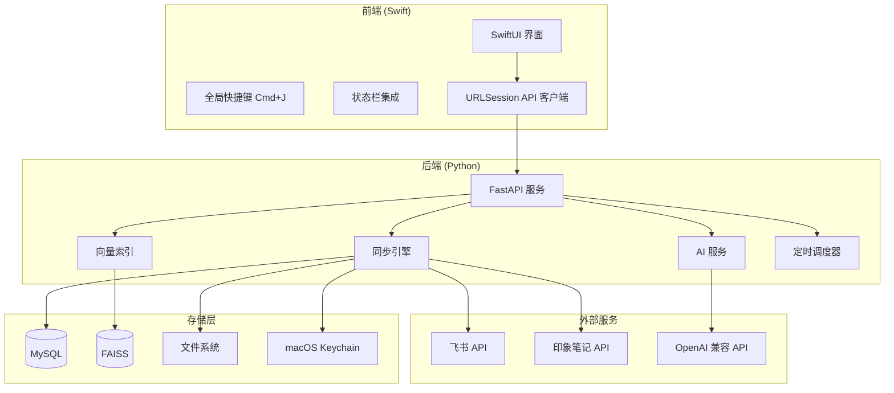
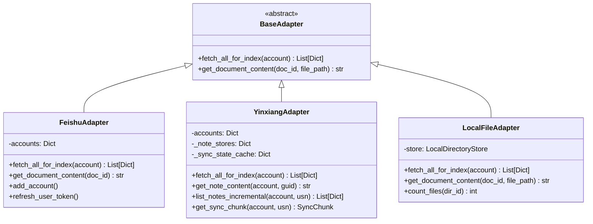
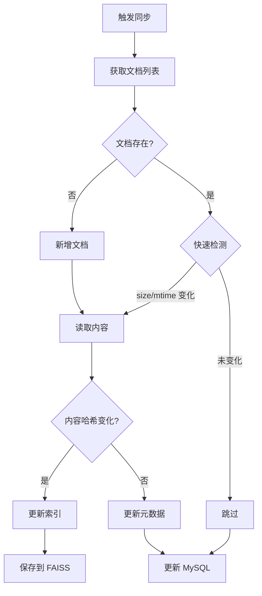
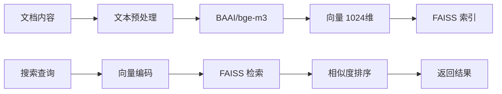
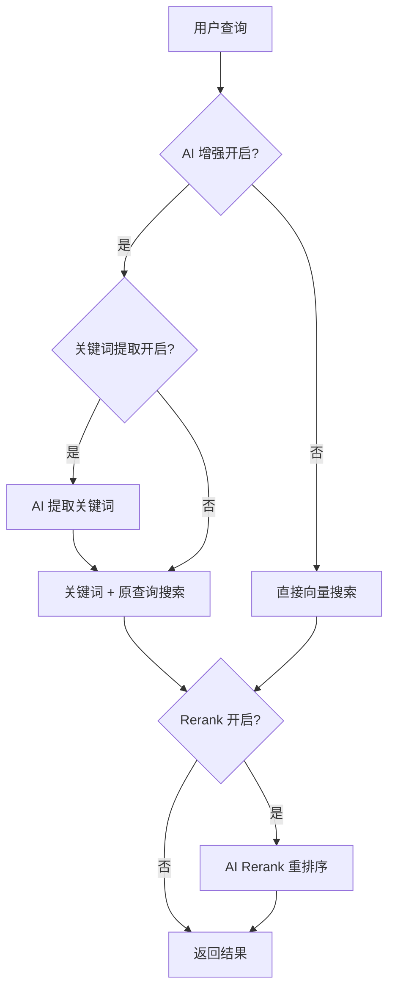
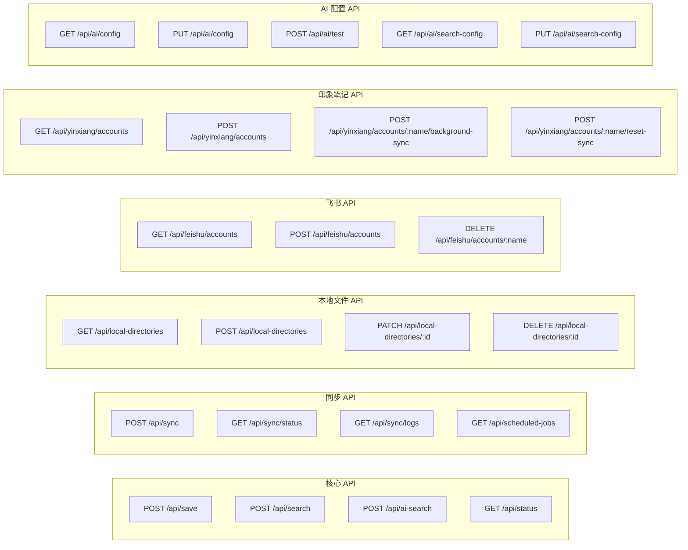
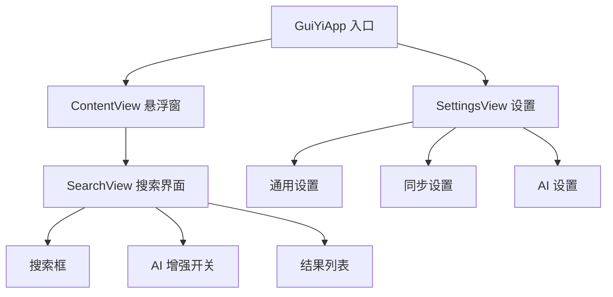
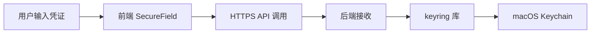

# GuiYi 技术架构文档

> 本地优先的个人知识收集与检索系统

---

## 系统架构概览



---

## 技术栈

### 前端技术栈

| 组件 | 技术 | 版本 | 用途 |
|-----|------|------|------|
| 语言 | Swift | 5.9+ | 原生开发 |
| UI 框架 | SwiftUI | - | 声明式界面 |
| 快捷键 | HotKey | - | 全局快捷键监听 (Cmd+J) |
| 网络请求 | URLSession | - | API 通信 |
| 数据存储 | @AppStorage | - | 用户偏好存储 |

### 后端技术栈

| 组件 | 技术 | 版本 | 用途 |
|-----|------|------|------|
| 语言 | Python | 3.11+ | 后端开发 |
| Web 框架 | FastAPI | - | REST API |
| 服务器 | Uvicorn | - | ASGI 服务器 |
| 向量引擎 | txtai | - | 语义索引 |
| 向量存储 | FAISS | 1.13.2 | 向量数据库 |
| 嵌入模型 | BAAI/bge-m3 | - | 多语言向量模型 |
| 网页抓取 | trafilatura | - | 内容提取 |
| 定时任务 | APScheduler | - | 同步调度 |
| 文件监听 | watchdog | - | 文件变更检测 |
| 凭证管理 | keyring | - | macOS Keychain |
| 飞书 SDK | lark-oapi | - | 飞书 API |
| PDF 解析 | PyPDF2 | - | PDF 内容提取 |
| Word 解析 | python-docx | - | Word 文档解析 |
| Excel 解析 | openpyxl | - | Excel 文档解析 |
| PPT 解析 | python-pptx | - | PPT 文档解析 |
| HTTP 客户端 | httpx | - | AI API 调用 |
| 数据库连接 | pymysql | - | MySQL 数据库连接 |

---

## 核心模块设计

### 1. 数据源适配器 (Adapters)



**适配器职责**：
- 统一不同数据源的接口
- 获取文档列表用于索引
- 提取文档内容
- 支持增量同步

### 2. 印象笔记适配器 (YinxiangAdapter)

印象笔记适配器使用 Thrift 协议直接连接 NoteStore API，支持：

**特性**：
- 支持 Developer Token 认证
- 支持国际版 Evernote 和中国版印象笔记
- 增量同步（基于 USN）
- API 限流自动处理

**URL 生成**：
```
https://app.yinxiang.com/shard/{shardId}/nl/{userId}/{noteGuid}
```

从 Token 解析参数：
- `S=s1` → shard_id
- `U=124701` → user_id

**限流处理策略**：

| 策略 | 说明 |
|------|------|
| API 调用间隔 | 1.5 秒 |
| 限流等待 | 等待 rateLimitDuration 后重试 |
| 重试次数 | 最多 3 次 |
| 待处理队列 | 限流失败的笔记保存到 pending 列表 |

### 3. 同步引擎 (Sync Engine)



**增量同步策略**：

| 检测层级 | 检测方式 | 性能 |
|---------|---------|------|
| 第一层 | file_size + file_mtime | 极快，不读文件 |
| 第二层 | content_hash (MD5) | 需读文件，中等 |
| 第三层 | 向量索引更新 | 最慢 |

### 4. 向量索引 (Vector Index)



**索引配置**：

```python
embeddings = Embeddings({
    "path": "BAAI/bge-m3",    # 多语言模型
    "content": False,          # 禁用 SQLite 内容存储
    "objects": True            # 启用对象存储
})
```

### 5. AI 搜索增强



**AI 搜索功能**：

| 功能 | 说明 | 开关 |
|------|------|------|
| 关键词提取 | 从查询中提取关键搜索词 | keyword_extraction_enabled |
| 智能重排 | 使用 Rerank 模型重新排序结果 | rerank_enabled |

---

## 存储架构

### 文件结构

```
data/
├── index/                      # 向量索引
│   ├── documents/
│   │   ├── embeddings          # FAISS 向量
│   │   ├── ids                 # 文档 ID 映射
│   │   └── config.json         # 索引配置
│   └── metadata.json           # 文档元数据
│
├── db_config.json              # 数据库配置 (MySQL)
│
├── ai_config.json              # AI 配置
│
├── search_config.json          # AI 搜索配置
│
├── scheduler_jobs.json         # 定时任务配置
│
├── yinxiang_sync_state.json    # 印象笔记同步状态
│
├── local_directories.json      # 本地目录配置
│
└── obsidian_vault/             # 网页存储
    └── inbox/
        └── *.md                # Markdown 文件
```

### 数据库设计

> 系统使用 MySQL 存储同步元数据，支持更大规模数据。

#### sync_metadata 表

| 字段 | 类型 | 说明 |
|-----|------|------|
| `id` | VARCHAR(255) | 文档唯一标识 |
| `source` | VARCHAR(50) | 数据源 (feishu/local/yinxiang) |
| `account` | VARCHAR(255) | 账号/目录标识 |
| `url` | TEXT | 原文链接/文件路径 |
| `title` | TEXT | 文档标题 |
| `content_hash` | VARCHAR(64) | 内容 MD5 哈希 |
| `file_size` | BIGINT | 文件大小 (字节) |
| `file_mtime` | DOUBLE | 文件修改时间戳 |
| `last_modified` | DOUBLE | 最后修改时间 |
| `last_synced` | DOUBLE | 最后同步时间 |
| `sync_status` | VARCHAR(20) | 状态 (synced/deleted) |
| `ai_summary` | TEXT | AI 生成的摘要 |
| `ai_tags` | TEXT | AI 生成的标签 (JSON) |

---

## API 设计

### RESTful API 端点



---

## 前端架构

### SwiftUI 视图层次



### 全局快捷键

- **Cmd+J**: 唤起搜索窗口
- 使用 NSEvent.addGlobalMonitorForEvents 实现

### 数据源图标

| 数据源 | 图标 | 颜色 |
|-------|------|------|
| 飞书 | 纸飞机 Shape | 蓝色 (#3370FF) |
| 本地文件 | 文件夹 SF Symbol | 橙色 (#F97316) |
| 网页 | 地球 SF Symbol | 绿色 (#22C55E) |
| 印象笔记 | 大象 Shape | 绿色 (#009933) |
| 夸克网盘 | 云 SF Symbol | 蓝色 (#3399FF) |

---

## 定时任务

### 调度器配置

定时任务使用 APScheduler 实现，配置持久化到 `data/scheduler_jobs.json`。

**默认任务**：

| 任务 | 执行时间 | 说明 |
|------|---------|------|
| feishu 同步 | 每天 12:00 | 同步飞书文档 |
| yinxiang 同步 | 每天 12:00 | 同步印象笔记 |
| local 同步 | 每天 12:00 | 同步本地文件 |
| quark 同步 | 每周一 08:00 | 同步夸克网盘 |

---

## 安全设计

### 凭证管理



**存储的凭证类型**：
- 飞书 App ID / App Secret
- 飞书 User Access Token / Refresh Token
- AI API Key
- 印象笔记 Developer Token

---

## 相关文档

- [需求与技术方案](./归一GuiYi-需求与技术方案.md)
- [飞书文档索引规则](./feishu-index-rules.md)
- [本地文件索引规则](./local-file-index-rules.md)
- [API 参考](./api-reference.md)
