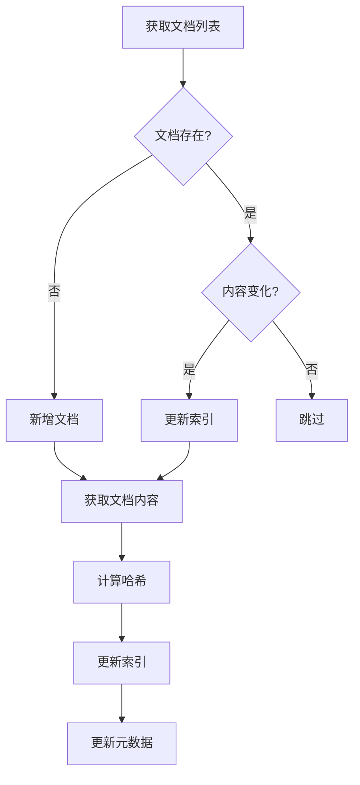

# 飞书文档索引规则

> GuiYi 项目飞书数据源索引技术文档

---

## 概述

GuiYi 支持索引飞书知识库和云空间文档，实现语义检索功能。

---

## 索引范围

### 支持的文档类型

| 文档类型 | obj_type | 内容获取 | 备注 |
|---------|----------|---------|------|
| 文档 | `docx` | ✅ 完整内容 | 最多 5000 字符 |
| 旧版文档 | `doc` | ✅ 完整内容 | 最多 5000 字符 |
| 电子表格 | `sheet` | ⚠️ 需额外授权 | 前 3 个工作表，每表 20 行 |
| 多维表格 | `bitable` | ⚠️ 需额外授权 | 前 3 个数据表，每表 20 条记录 |
| 思维导图 | `mindnote` | ❌ 仅基本信息 | 待完善 |
| Wiki 页面 | `wiki` | ✅ 同 docx | - |

### 支持的来源

| 来源 | 描述 | API |
|-----|------|-----|
| 知识库 | 飞书 Wiki 空间 | `/open-apis/wiki/v2/spaces` |
| 云空间 | 个人/企业云盘 | `/open-apis/drive/v1/files` |

---

## 索引内容

### 已索引字段

| 字段 | 说明 |
|-----|------|
| `id` | 文档唯一标识 |
| `title` | 文档标题 |
| `content` | 文档正文内容 |
| `url` | 原文链接 |
| `source` | 数据源标识 (`feishu`) |
| `account` | 账号标识 |
| `doc_type` | 文档来源类型 (`wiki`/`drive`) |
| `obj_type` | 文档对象类型 |
| `space_name` | 知识库名称（仅 wiki） |

### 索引结构

```
索引文本 = {标题} + "\n\n" + {正文内容}
```

---

## 同步机制

### 增量同步

通过内容哈希（MD5）检测变更：



### 同步频率

通过前端设置界面配置，支持：

- 每小时
- 每 6 小时
- 每天 9:00 / 12:00 / 18:00
- 每周一 8:00
- 手动触发

---

## 认证机制

### 用户令牌（推荐）

使用 `user_access_token` 访问知识库：

```python
account = FeishuAccount(
    name="wiki_user",
    app_id="cli_xxx",
    app_secret="xxx",
    user_access_token="u-xxx",
    refresh_token="ur-xxx"
)
```

### 令牌刷新

飞书用户令牌有效期有限，需定期刷新：

```python
# 刷新令牌
account.refresh_user_token()

# 保存新令牌
KeychainManager.save_feishu_account(
    name='wiki_user',
    user_access_token=account.user_access_token,
    refresh_token=account.refresh_token
)
```

### 凭证存储

使用 macOS Keychain 安全存储：

```python
from storage.keychain import KeychainManager

# 保存凭证
KeychainManager.save_feishu_account(
    name='wiki_user',
    app_id='cli_xxx',
    app_secret='xxx',
    user_access_token='u-xxx',
    refresh_token='ur-xxx'
)

# 获取凭证
credentials = KeychainManager.get_feishu_account('wiki_user')
```

---

## API 端点

### 同步管理

| 方法 | 端点 | 说明 |
|-----|------|------|
| POST | `/api/sync` | 触发同步 |
| GET | `/api/sync/status` | 获取同步状态 |
| GET | `/api/scheduler/jobs` | 获取定时任务 |
| POST | `/api/scheduler/jobs` | 添加定时任务 |
| DELETE | `/api/scheduler/jobs/{job_id}` | 删除定时任务 |

### 账号管理

| 方法 | 端点 | 说明 |
|-----|------|------|
| POST | `/api/feishu/accounts` | 添加飞书账号 |
| GET | `/api/feishu/accounts` | 获取账号列表 |
| DELETE | `/api/feishu/accounts/{name}` | 删除账号 |
| POST | `/api/feishu/accounts/{name}/token` | 设置用户令牌 |

---

## 权限要求

### 飞书应用权限

| 权限 | 用途 |
|-----|------|
| `wiki:wiki:readonly` | 读取知识库 |
| `drive:drive:readonly` | 读取云空间 |
| `docs:doc:readonly` | 读取文档 |
| `sheets:spreadsheet:readonly` | 读取电子表格（可选） |
| `bitable:app:readonly` | 读取多维表格（可选） |

### OAuth 授权范围

```
contact:user.base:readonly
wiki:wiki:readonly
drive:drive:readonly
docs:doc:readonly
```

---

## 故障排除

### 常见错误

| 错误 | 原因 | 解决方案 |
|-----|------|---------|
| `Authentication token expired` | 令牌过期 | 刷新令牌 |
| `Invalid access token` | 令牌无效 | 重新授权 |
| `Unauthorized` | 权限不足 | 添加应用权限 |
| `missing app id or app secret` | 刷新失败 | 检查应用配置 |

### 日志查看

```bash
# 查看后端日志
tail -f /tmp/guiyi_backend.log

# 查看同步日志
tail -f /tmp/sync_log.txt
```

---

## 相关文件

```
guiyi-server/
├── adapters/
│   └── feishu_adapter.py    # 飞书适配器
├── sync/
│   ├── engine.py            # 同步引擎
│   ├── scheduler.py         # 定时任务
│   └── metadata.py          # 元数据管理
├── index/
│   └── txtai_index.py       # 向量索引
├── storage/
│   └── keychain.py          # 凭证管理
└── sync_feishu_wiki.py      # 同步脚本
```
