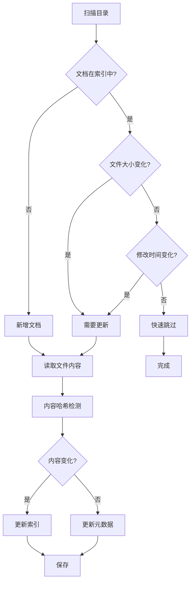
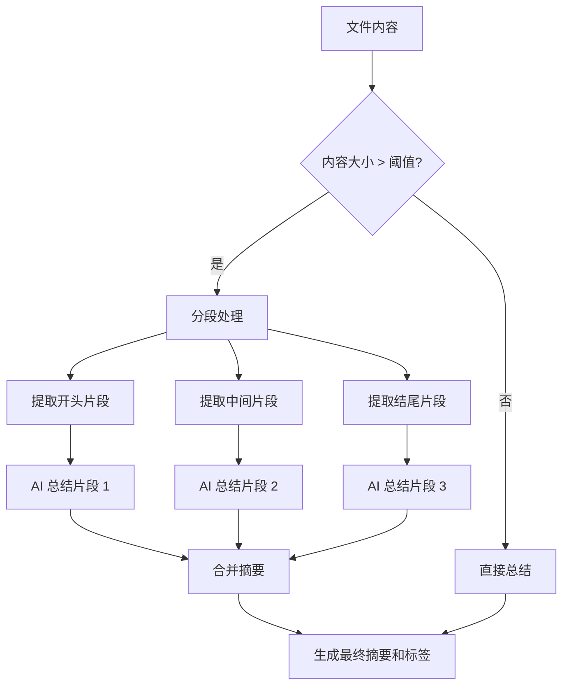

# 本地文件索引规则

> GuiYi 项目本地文件数据源索引技术文档

---

## 概述

GuiYi 支持索引本地文件系统中的文档，实现跨平台文档的语义检索功能。

---

## 索引范围

### 支持的文件类型

默认支持以下文件类型：

| 类型 | 扩展名 | 内容提取 | 备注 |
|-----|--------|---------|------|
| Markdown | `.md`, `.markdown` | ✅ 完整内容 | - |
| 纯文本 | `.txt` | ✅ 完整内容 | - |
| PDF | `.pdf` | ✅ 完整内容 | 使用 PyPDF2 |
| Word | `.docx`, `.doc` | ✅ 完整内容 | 使用 python-docx |
| Excel | `.xlsx`, `.xls` | ✅ 文本内容 | 提取所有工作表文本 |
| PPT | `.pptx`, `.ppt` | ✅ 文本内容 | 提取所有幻灯片文本 |

### 排除规则

默认排除以下目录和文件：

```python
DEFAULT_EXCLUDE_PATTERNS = [
    ".git", ".svn", ".hg",           # 版本控制
    "node_modules",                   # Node.js 依赖
    "__pycache__", ".venv", "venv",  # Python 缓存和虚拟环境
    ".idea", ".vscode",               # IDE 配置
    "dist", "build", "target",        # 构建输出
    ".DS_Store", "Thumbs.db",         # 系统文件
    "vendor",                         # 第三方依赖
]
```

### 限制条件

| 限制 | 默认值 | 说明 |
|-----|--------|------|
| 最大文件大小 | 10 MB | 超过此大小的文件将被跳过 |
| 最大递归深度 | 10 层 | 目录遍历的最大深度 |
| 最大嵌入长度 | 500 字符 | 用于向量嵌入的文本长度 |
| 最大预览长度 | 1000 字符 | 用于搜索结果预览的文本长度 |

---

## 增量同步机制

### 快速检测策略

使用文件元数据进行快速变更检测，无需读取文件内容：



### 元数据存储

每个索引文档记录以下元数据：

| 字段 | 类型 | 说明 |
|-----|------|------|
| `id` | TEXT | 文档唯一标识 |
| `source` | TEXT | 数据源 (`local`) |
| `account` | TEXT | 目录 ID |
| `url` | TEXT | 文件路径 |
| `title` | TEXT | 文件名 |
| `content_hash` | TEXT | 内容 MD5 哈希 |
| `file_size` | INTEGER | 文件大小（字节） |
| `file_mtime` | REAL | 文件修改时间戳 |
| `last_synced` | REAL | 最后同步时间戳 |
| `ai_summary` | TEXT | AI 生成的摘要 |
| `ai_tags` | TEXT | AI 生成的标签（JSON） |

---

## AI 智能总结

### 触发条件

当文件大小超过配置阈值（默认 10KB）时，自动调用 AI 生成摘要和标签。

### 大文件处理策略

对于超大文件，采用分段处理策略：



### 分段参数

| 参数 | 默认值 | 说明 |
|-----|--------|------|
| `chunk_size_kb` | 8 KB | 每段大小 |
| `max_content_kb` | 50 KB | 触发分段的内容阈值 |
| `max_tokens` | 1000 | AI 响应最大 token 数 |

### 提示词模板

#### 完整内容总结提示词

```
你是一个文档分析助手。请分析以下文档内容，生成：
1. 简洁的摘要（不超过200字）
2. 3-5个关键词标签
3. 核心要点（2-3条）

文档标题：{title}
文档类型：{file_type}

文档内容：
{content}

请以 JSON 格式返回：
{
    "summary": "摘要内容",
    "tags": ["标签1", "标签2", "标签3"],
    "key_info": ["要点1", "要点2"]
}
```

#### 片段总结提示词

```
你是一个文档分析助手。这是大文档的片段摘要任务。

文档标题：{title}
文档类型：{file_type}
片段位置：{position}

片段内容：
{content}

请简要总结这个片段的关键内容（不超过100字）：
```

#### 合并摘要提示词

```
你是一个文档分析助手。请合并以下片段摘要，生成完整文档的分析：

文档标题：{title}

片段摘要列表：
{summaries}

请生成：
1. 完整摘要（不超过300字）
2. 5-8个关键词标签
3. 核心要点（3-5条）

以 JSON 格式返回：
{
    "summary": "摘要内容",
    "tags": ["标签1", "标签2"],
    "key_info": ["要点1", "要点2"]
}
```

### AI 配置

```json
{
    "enabled": true,
    "api_base": "https://api.openai.com/v1",
    "api_key": "sk-xxx",
    "model": "gpt-4o-mini",
    "summary_threshold_kb": 10,
    "max_tokens": 1000,
    "chunk_size_kb": 8,
    "max_content_kb": 50,
    "summary_prompt": "",
    "partial_prompt": "",
    "merge_prompt": ""
}
```

---

## 索引内容结构

### 索引文本构建

```python
if ai_summary:
    # 使用 AI 生成的摘要和标签
    index_content = f"{title}\n\n[AI 摘要]\n{ai_summary}\n\n[标签] {', '.join(ai_tags)}\n\n[原文片段]\n{content[:500]}"
else:
    # 直接使用原文
    index_content = f"{title}\n\n{content}"
```

### 索引字段

| 字段 | 说明 |
|-----|------|
| `id` | 文件唯一标识 |
| `title` | 文件名 |
| `content` | 索引文本 |
| `url` | 文件路径 |
| `source` | `local` |
| `account` | 目录 ID |
| `file_type` | 文件扩展名 |

---

## API 端点

### 目录管理

| 方法 | 端点 | 说明 |
|-----|------|------|
| GET | `/api/local-directories/file-types` | 获取支持的文件类型 |
| POST | `/api/local-directories` | 添加本地目录 |
| GET | `/api/local-directories` | 获取目录列表 |
| PATCH | `/api/local-directories/{id}` | 更新目录配置 |
| DELETE | `/api/local-directories/{id}` | 删除目录配置 |

### AI 配置

| 方法 | 端点 | 说明 |
|-----|------|------|
| GET | `/api/ai/config` | 获取 AI 配置 |
| PUT | `/api/ai/config` | 更新 AI 配置 |
| POST | `/api/ai/test` | 测试 AI 连接 |

### 同步管理

| 方法 | 端点 | 说明 |
|-----|------|------|
| POST | `/api/sync` | 触发同步（`source: "local"`） |
| GET | `/api/sync/status` | 获取同步状态 |

---

## 安全措施

### 只读保证

所有文件操作均为只读：

```python
# ✅ 正确：只读模式
with open(file_path, 'r', encoding='utf-8') as f:
    content = f.read()

# ❌ 禁止：写入操作
# 不使用 'w', 'a', 'wb' 等写入模式
# 不调用 os.remove, shutil.rmtree 等删除函数
```

### 路径安全

- 禁止索引敏感路径：`~/.ssh`, `/etc`, `/System` 等
- 限制最大递归深度
- 限制最大文件大小

---

## 故障排除

### 常见问题

| 问题 | 原因 | 解决方案 |
|-----|------|---------|
| 文件未被索引 | 文件类型不在支持列表 | 在设置中添加文件类型 |
| 文件内容乱码 | 编码问题 | 尝试不同的编码 |
| 同步速度慢 | 文件数量多 | 检查排除规则是否生效 |
| AI 总结失败 | API 配置错误 | 检查 API Key 和地址 |

### 日志查看

```bash
# 查看后端日志
tail -f /tmp/guiyi-server.log

# 过滤本地文件同步日志
tail -f /tmp/guiyi-server.log | grep "本地文件"
```

---

## 相关文件

```
guiyi-server/
├── adapters/
│   └── local_file_adapter.py    # 本地文件适配器
├── ai/
│   ├── ai_service.py            # AI 服务
│   └── config_store.py          # AI 配置存储
├── sync/
│   ├── engine.py                # 同步引擎
│   └── metadata.py              # 元数据管理
├── storage/
│   └── local_directory_store.py # 目录配置存储
├── parsers/
│   ├── markdown_parser.py       # Markdown 解析
│   ├── txt_parser.py            # 纯文本解析
│   ├── pdf_parser.py            # PDF 解析
│   ├── word_parser.py           # Word 解析
│   ├── excel_parser.py          # Excel 解析
│   └── ppt_parser.py            # PPT 解析
└── main_phase3.py               # API 入口
```

---

## 配置示例

### 添加本地目录

```bash
curl -X POST http://localhost:8765/api/local-directories \
  -H "Content-Type: application/json" \
  -d '{
    "name": "项目文档",
    "path": "/Users/xxx/Documents",
    "file_types": [".md", ".txt", ".pdf", ".docx"],
    "exclude_patterns": [".git", "node_modules"],
    "enabled": true,
    "max_depth": 10,
    "max_file_size_mb": 10
  }'
```

### 配置 AI 服务

```bash
curl -X PUT http://localhost:8765/api/ai/config \
  -H "Content-Type: application/json" \
  -d '{
    "enabled": true,
    "api_base": "https://api.openai.com/v1",
    "api_key": "sk-xxx",
    "model": "gpt-4o-mini",
    "summary_threshold_kb": 10
  }'
```

### 触发同步

```bash
curl -X POST http://localhost:8765/api/sync \
  -H "Content-Type: application/json" \
  -d '{"source": "local"}'
```
