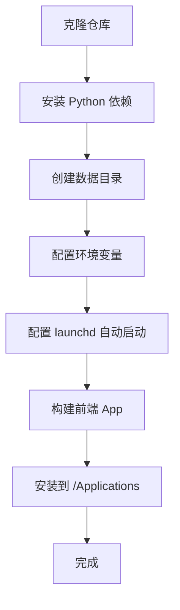

# GuiYi 通用部署指南

> 本文档描述如何将 GuiYi 部署到任意 macOS 机器上，适用于生产环境或个人使用。

---

## 目录

1. [概述](#概述)
2. [环境要求](#环境要求)
3. [部署步骤](#部署步骤)
4. [配置说明](#配置说明)
5. [启动和停止](#启动和停止)
6. [监控和日志](#监控和日志)
7. [备份和恢复](#备份和恢复)
8. [故障排查](#故障排查)
9. [安全建议](#安全建议)

---

## 概述

GuiYi 由两部分组成：

| 组件 | 技术栈 | 说明 |
|------|--------|------|
| 后端服务 | Python + FastAPI | HTTP API 服务，监听 `localhost:8765` |
| 前端应用 | Swift + SwiftUI | macOS 状态栏应用，连接后端 API |

部署流程：



**核心原则：**

- 后端只监听 `127.0.0.1`，不对外暴露
- 所有数据存储在本地
- 凭证通过环境变量 + macOS Keychain 管理
- 使用 launchd 管理后端进程生命周期

---

## 环境要求

| 组件 | 版本要求 | 备注 |
|------|---------|------|
| macOS | 12.0+ | 前端依赖 SwiftUI 3.0+ |
| Python | 3.11+ | |
| uv | 最新版 | 包管理器，`brew install uv` |
| Xcode | 14+ | 仅构建前端时需要 |

可选依赖：

| 组件 | 说明 |
|------|------|
| MLX + MLX-VLM | Apple Silicon 上的图片索引功能 |

---

## 部署步骤

### 1. 获取代码

```bash
git clone <repo-url> /path/to/GuiYi
cd /path/to/GuiYi
```

### 2. 部署后端

#### 2.1 创建虚拟环境

```bash
cd guiyi-server
uv venv
source .venv/bin/activate
```

#### 2.2 安装依赖

```bash
uv pip install -r requirements.txt
```

> **注意**：如果目标机器不是 Apple Silicon，需注释掉 `requirements.txt` 中的 `mlx` 和 `mlx-vlm` 行。

#### 2.3 准备数据目录

```bash
mkdir -p data/obsidian_vault/inbox
mkdir -p data/index
```

数据目录结构：

```
data/
├── db_config.json          # 数据库配置（自动生成）
├── obsidian_vault/         # 网页内容存储
│   └── inbox/
├── index/                  # txtai 语义索引
├── ai_config.json          # AI 配置（自动生成）
└── scheduler_jobs.json     # 定时任务（自动生成）
```

同步元数据、同步日志、本地目录配置和搜索反馈存储在 MySQL。MySQL 连接信息写入 `data/db_config.json`。

#### 2.4 配置环境变量

创建环境变量文件（例如 `~/.guiyi.env`）：

```bash
# 必需配置
GUIYI_DATA_DIR=/path/to/GuiYi/guiyi-server/data

# 可选配置
API_HOST=127.0.0.1
API_PORT=8765
API_DEBUG=false

# 嵌入模型路径（可选，不设则自动下载）
GUIYI_EMBEDDING_MODEL_PATH=/path/to/models/bge-m3

# 图片索引（可选，仅 Apple Silicon）
GUIYI_IMAGE_INDEX_ENABLED=true
GUIYI_IMAGE_VLM_MODEL=mlx-community/Qwen2-VL-2B-Instruct-4bit

# 飞书凭证（可选）
FEISHU_COMPANY_APP_ID=cli_xxx
FEISHU_COMPANY_APP_SECRET=xxx

# 印象笔记凭证（可选）
YINXIANG_DEV_TOKEN=xxx

# 夸克网盘 Cookie（可选）
QUARK_COOKIE=xxx
```

所有支持的环境变量见 [配置说明](#配置说明)。

#### 2.5 验证后端

```bash
cd guiyi-server
source .venv/bin/activate
python -m guiyi_server
```

启动后访问 `http://localhost:8765/docs` 确认 API 文档可见。

### 3. 配置 launchd 自动启动

创建 launchd 配置文件 `~/Library/LaunchAgents/com.guiyi.backend.plist`：

```xml
<?xml version="1.0" encoding="UTF-8"?>
<!DOCTYPE plist PUBLIC "-//Apple//DTD PLIST 1.0//EN"
  "http://www.apple.com/DTDs/PropertyList-1.0.dtd">
<plist version="1.0">
<dict>
  <key>Label</key>
  <string>com.guiyi.backend</string>

  <key>ProgramArguments</key>
  <array>
    <string>/path/to/GuiYi/guiyi-server/scripts/start_backend.sh</string>
  </array>

  <key>WorkingDirectory</key>
  <string>/path/to/GuiYi/guiyi-server</string>

  <key>EnvironmentVariables</key>
  <dict>
    <key>GUIYI_DATA_DIR</key>
    <string>/path/to/GuiYi/guiyi-server/data</string>
  </dict>

  <key>RunAtLoad</key>
  <true/>

  <key>KeepAlive</key>
  <true/>

  <key>StandardOutPath</key>
  <string>/path/to/GuiYi/logs/guiyi-server.log</string>

  <key>StandardErrorPath</key>
  <string>/path/to/GuiYi/logs/guiyi-server.error.log</string>
</dict>
</plist>
```

> **注意**：将 `/path/to/GuiYi` 替换为实际路径。`start_backend.sh` 脚本会自动加载 `.env` 文件中的环境变量。

加载服务：

```bash
launchctl bootstrap gui/$(id -u) ~/Library/LaunchAgents/com.guiyi.backend.plist
```

验证：

```bash
launchctl list | grep guiyi
```

### 4. 部署前端

#### 4.1 构建 App

```bash
cd guiyi-client
xcodebuild -project GuiYi.xcodeproj \
  -scheme GuiYi \
  -configuration Release \
  -archivePath build/GuiYi.xcarchive \
  archive

# 导出 .app
xcodebuild -exportArchive \
  -archivePath build/GuiYi.xcarchive \
  -exportPath build/Release \
  -exportOptionsPlist exportOptions.plist
```

#### 4.2 安装

```bash
cp -r guiyi-client/build/Release/GuiYi.app /Applications/
```

#### 4.3 设置开机自启

- 系统偏好设置 → 用户与群组 → 登录项
- 添加 `GuiYi.app`

---

## 配置说明

### 后端环境变量

#### 核心配置

| 变量 | 默认值 | 说明 |
|------|--------|------|
| `GUIYI_DATA_DIR` | `guiyi-server/data/` | 数据根目录，**推荐显式设置** |
| `API_HOST` | `127.0.0.1` | 监听地址，**不要改为 0.0.0.0** |
| `API_PORT` | `8765` | 监听端口 |
| `API_DEBUG` | `true` | 调试模式，生产环境设为 `false` |

#### 数据路径（派生自 `GUIYI_DATA_DIR`）

| 变量 | 默认值 | 说明 |
|------|--------|------|
| `DB_CONFIG_PATH` | `{DATA_DIR}/db_config.json` | 数据库配置 |
| `OBSIDIAN_VAULT_PATH` | `{DATA_DIR}/obsidian_vault` | Obsidian 存储 |
| `INDEX_PATH` | `{DATA_DIR}/index` | txtai 索引目录 |
| `AI_CONFIG_PATH` | `{DATA_DIR}/ai_config.json` | AI 配置 |
| `SCHEDULER_JOBS_PATH` | `{DATA_DIR}/scheduler_jobs.json` | 定时任务 |
| `WEB_ASSETS_PATH` | `{DATA_DIR}/obsidian_vault/inbox/assets` | 网页资源 |

#### 数据源凭证

| 变量 | 说明 |
|------|------|
| `FEISHU_COMPANY_APP_ID` | 飞书企业应用 ID |
| `FEISHU_COMPANY_APP_SECRET` | 飞书企业应用密钥 |
| `FEISHU_PERSONAL_APP_ID` | 飞书个人应用 ID |
| `FEISHU_PERSONAL_APP_SECRET` | 飞书个人应用密钥 |
| `YINXIANG_DEV_TOKEN` | 印象笔记开发者 Token |
| `QUARK_COOKIE` | 夸克网盘 Cookie |
| `WPS_WATCH_DIRS` | WPS 监听目录（逗号分隔） |

#### 同步配置

| 变量 | 默认值 | 说明 |
|------|--------|------|
| `SYNC_INTERVAL_HOURS` | `24` | 定时同步间隔（小时） |
| `GUIYI_SKIP_STARTUP_ACCOUNT_LOAD` | - | 设为 `true` 跳过启动时加载账户 |

#### 嵌入模型配置

| 变量 | 默认值 | 说明 |
|------|--------|------|
| `GUIYI_EMBEDDING_MODEL_PATH` | 自动下载 | 嵌入模型本地路径 |
| `GUIYI_EMBEDDING_DEVICE` | 自动选择 | 推理设备（cpu/mps/cuda） |
| `GUIYI_SEARCH_MODE` | 自动选择 | 搜索模式 |

#### 图片索引配置（可选）

| 变量 | 默认值 | 说明 |
|------|--------|------|
| `GUIYI_IMAGE_INDEX_ENABLED` | `false` | 启用图片索引 |
| `GUIYI_IMAGE_VLM_MODEL` | `mlx-community/Qwen2-VL-2B-Instruct-4bit` | VLM 模型 |
| `GUIYI_IMAGE_MAX_SIDE` | `1024` | 图片最大边长 |
| `GUIYI_IMAGE_MAX_TOKENS` | `256` | 最大 token 数 |
| `GUIYI_IMAGE_IDLE_UNLOAD_MINUTES` | `30` | 空闲后卸载模型 |

---

## 启动和停止

### 使用 launchd（推荐）

```bash
# 加载服务（开机自启）
launchctl bootstrap gui/$(id -u) ~/Library/LaunchAgents/com.guiyi.backend.plist

# 停止服务
launchctl bootout gui/$(id -u)/com.guiyi.backend

# 重启服务
launchctl kickstart -k gui/$(id -u)/com.guiyi.backend

# 查看状态
launchctl print gui/$(id -u)/com.guiyi.backend
```

### 手动启动（调试用）

```bash
cd /path/to/GuiYi/guiyi-server
source .venv/bin/activate
source ~/.guiyi.env   # 加载环境变量
python -m guiyi_server
```

### 便捷管理脚本

在部署目录下创建以下脚本：

**start.sh**：

```bash
#!/usr/bin/env bash
set -euo pipefail
APP_DIR="/path/to/GuiYi/guiyi-server"
ENV_FILE="$HOME/.guiyi.env"

if [[ -f "${ENV_FILE}" ]]; then
  set -a; source "${ENV_FILE}"; set +a
fi

cd "${APP_DIR}"
exec .venv/bin/python -m guiyi_server
```

**stop.sh**：

```bash
#!/usr/bin/env bash
launchctl bootout gui/$(id -u)/com.guiyi.backend 2>/dev/null || true
```

**status.sh**：

```bash
#!/usr/bin/env bash
launchctl print gui/$(id -u)/com.guiyi.backend 2>/dev/null || echo "Service not loaded"
lsof -nP -iTCP:8765 -sTCP:LISTEN 2>/dev/null || echo "Port 8765 not in use"
```

---

## 监控和日志

### 日志位置

launchd 模式下，日志输出到 plist 中配置的路径：

```bash
# 标准输出
tail -f /path/to/GuiYi/logs/guiyi-server.log

# 错误输出
tail -f /path/to/GuiYi/logs/guiyi-server.error.log
```

### 检查服务状态

```bash
# launchd 状态
launchctl list | grep guiyi

# 端口占用
lsof -i :8765

# 进程
ps aux | grep guiyi
```

### 监控索引状态

```bash
# 索引大小
du -sh /path/to/GuiYi/guiyi-server/data/index/

# 同步元数据统计（按 data/db_config.json 中的 MySQL 配置连接）
mysql -h <host> -P <port> -u <user> -p <database> \
  -e "SELECT source, COUNT(*) FROM sync_metadata GROUP BY source;"
```

---

## 备份和恢复

### 备份

```bash
BACKUP_DIR=~/Backup/GuiYi/$(date +%Y%m%d)
mkdir -p "$BACKUP_DIR"
cp -r /path/to/GuiYi/guiyi-server/data/ "$BACKUP_DIR/"
echo "Backup completed: $BACKUP_DIR"
```

建议设置 cron 定时备份：

```bash
# 每天凌晨 2 点备份
0 2 * * * ~/backup-guiyi.sh
```

### 恢复

```bash
# 1. 停止服务
launchctl bootout gui/$(id -u)/com.guiyi.backend

# 2. 恢复数据
cp -r ~/Backup/GuiYi/20260404/data/ /path/to/GuiYi/guiyi-server/

# 3. 重启服务
launchctl bootstrap gui/$(id -u) ~/Library/LaunchAgents/com.guiyi.backend.plist
```

---

## 故障排查

### 后端无法启动

**症状**：`launchctl list` 中看不到服务，或状态为非 0。

**排查步骤**：

1. 查看错误日志：
   ```bash
   cat /path/to/GuiYi/logs/guiyi-server.error.log
   ```

2. 手动启动测试：
   ```bash
   cd /path/to/GuiYi/guiyi-server
   source .venv/bin/activate
   python -m guiyi_server
   ```

3. 检查 Python 环境：
   ```bash
   .venv/bin/python --version
   .venv/bin/python -c "import fastapi; print('ok')"
   ```

**常见原因**：

| 原因 | 解决方法 |
|------|---------|
| 虚拟环境路径错误 | 检查 plist 中的路径是否与实际一致 |
| 依赖未安装 | `uv pip install -r requirements.txt` |
| 端口被占用 | `lsof -i :8765` 查看并释放 |
| 环境变量未设置 | 确认 `~/.guiyi.env` 存在且可读 |

### 前端无法连接后端

**症状**：前端显示"服务未运行"。

**排查步骤**：

1. 验证后端运行：
   ```bash
   curl http://localhost:8765/api/status
   ```

2. 检查 App Sandbox 权限：
   - Xcode → Signing & Capabilities → App Sandbox
   - 确保勾选 **Outgoing Connections (Client)**

3. 检查防火墙：
   - 系统偏好设置 → 安全性与隐私 → 防火墙

### 索引构建失败

**症状**：搜索无结果或报错。

**排查步骤**：

1. 检查磁盘空间：
   ```bash
   df -h
   ```

2. 检查模型文件：
   ```bash
   ls -lh ~/.cache/huggingface/hub/
   # 或自定义模型路径
   ls -lh $GUIYI_EMBEDDING_MODEL_PATH
   ```

3. 重建索引：
   ```bash
   rm -rf /path/to/GuiYi/guiyi-server/data/index/
   # 重启服务，自动重建
   ```

### 飞书同步失败

1. 检查凭证是否配置在环境变量中
2. 确认飞书应用权限（开放平台 → 应用权限）
3. 查看日志：`grep "feishu" /path/to/GuiYi/logs/guiyi-server.log`

---

## 安全建议

1. **不要暴露端口**：`API_HOST` 保持 `127.0.0.1`，不要改为 `0.0.0.0`
2. **凭证管理**：
   - 环境变量文件（`~/.guiyi.env`）权限设为 `600`
   - 不要将凭证提交到 Git
   - 使用 macOS Keychain 存储敏感凭证
3. **定期更新依赖**：
   ```bash
   cd guiyi-server
   source .venv/bin/activate
   uv pip list --outdated
   ```
4. **检查凭证泄露**：
   ```bash
   git log --all --full-history -- "*.env" "*.pem" "credentials.json"
   ```
