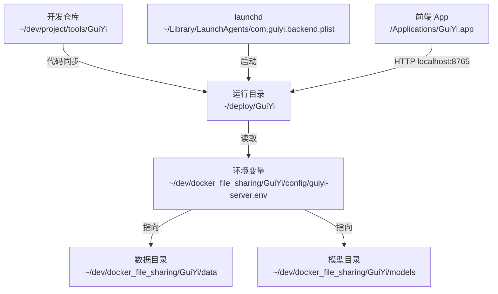

# GuiYi 本机部署指南

> 本文档描述 GuiYi 在本机（开发机）的实际部署布局：代码、虚拟环境、数据、模型、配置、日志各自放在哪里，以及它们之间的关系。

---

## 目录

1. [本机部署总览](#本机部署总览)
2. [目录布局](#目录布局)
3. [关键文件位置](#关键文件位置)
4. [启动和停止](#启动和停止)
5. [日常运维操作](#日常运维操作)
6. [开发与部署边界](#开发与部署边界)

---

## 本机部署总览

本机采用 **代码与运行环境分离** 的布局：开发仓库只是源码，真正运行的是 `~/deploy/GuiYi/` 下的副本，由 launchd 托管。**数据和模型不放在仓库内**，单独存放在 `~/dev/docker_file_sharing/GuiYi/` 下。



---

## 目录布局

### 1. 开发仓库（源码）

**路径**：`~/dev/project/tools/GuiYi/`

```
~/dev/project/tools/GuiYi/
├── guiyi-server/                # Python 后端源码
│   ├── guiyi_server/            # 主包
│   ├── scripts/                 # 启动脚本（start_backend.sh 等）
│   ├── Makefile
│   ├── main.py                  # 兼容入口
│   └── requirements.txt
├── guiyi-client/                # Swift 前端源码
│   ├── GuiYi/
│   └── GuiYi.xcodeproj/
└── docs/                        # 文档
```

> **注意**：仓库中的开发运行时资产只允许使用 `data-dev/`、`models-dev/`、本地 `.env.dev` 或 `guiyi-server.dev.env`，并且都不提交 Git。部署环境不使用这些开发资产。

### 2. 运行目录（实际运行的服务）

**路径**：`/Users/yswwpp/deploy/GuiYi/`

```
~/deploy/GuiYi/
├── .venv/                       # Python 虚拟环境（运行时使用）
├── guiyi-server/                # 后端代码副本（从开发仓库同步）
│   ├── guiyi_server/
│   ├── data/                    # 旧数据残留，实际不用（数据走 GUIYI_DATA_DIR）
│   ├── logs/
│   └── ...
├── logs/                        # launchd 日志
│   ├── guiyi-server.log         # 应用 stdout
│   ├── guiyi-server.launchd.log
│   └── guiyi-server.launchd.err
├── start.sh                     # launchd 调用的启动入口
├── load.sh                      # 加载 / 重启 launchd 服务
├── stop.sh                      # 停止服务
├── status.sh                    # 查看状态
└── run-background.sh            # 不走 launchd，nohup 后台运行
```

### 3. 数据与模型目录

**路径**：`/Users/yswwpp/dev/docker_file_sharing/GuiYi/`

```
~/dev/docker_file_sharing/GuiYi/
├── config/
│   └── guiyi-server.env         # 环境变量配置（被 start.sh 加载）
├── data/                        # 所有运行时数据
│   ├── db_config.json
│   ├── ai_config.json
│   ├── scheduler_jobs.json
│   ├── wps_buffer.json
│   ├── yinxiang_accounts.json
│   ├── yinxiang_sync_state.json
│   ├── index/                   # txtai 语义索引
│   └── obsidian_vault/          # 网页正文 + 资源
│       └── inbox/
│           └── assets/
└── models/                      # AI 模型（不放仓库内）
    ├── BAAI/
    │   └── bge-m3/              # 嵌入模型
    └── mlx-community/
        ├── Qwen2-VL-7B-Instruct-4bit
        └── Qwen2.5-VL-7B-Instruct-4bit  # 图片索引 VLM
```

### 4. 系统级文件

| 文件 | 路径 | 作用 |
|------|------|------|
| launchd plist | `~/Library/LaunchAgents/com.guiyi.backend.plist` | 后端服务定义 |
| 前端 App | `/Applications/GuiYi.app`（Xcode 构建后手动安装） | 状态栏应用 |

---

## 关键文件位置

| 类型 | 实际路径 |
|------|---------|
| **后端运行入口** | `~/deploy/GuiYi/start.sh` |
| **Python 解释器** | `~/deploy/GuiYi/.venv/bin/python` |
| **环境变量文件** | `~/dev/docker_file_sharing/GuiYi/config/guiyi-server.env` |
| **launchd plist** | `~/Library/LaunchAgents/com.guiyi.backend.plist` |
| **应用日志（stdout）** | `~/deploy/GuiYi/logs/guiyi-server.log` |
| **launchd 日志** | `~/deploy/GuiYi/logs/guiyi-server.launchd.log` |
| **launchd 错误日志** | `~/deploy/GuiYi/logs/guiyi-server.launchd.err` |
| **数据根目录** | `~/dev/docker_file_sharing/GuiYi/data/` |
| **MySQL 配置文件** | `~/dev/docker_file_sharing/GuiYi/data/db_config.json` |
| **MySQL schema** | `guiyi` |
| **索引目录** | `~/dev/docker_file_sharing/GuiYi/data/index/` |
| **Obsidian 仓库** | `~/dev/docker_file_sharing/GuiYi/data/obsidian_vault/` |
| **嵌入模型** | `~/dev/docker_file_sharing/GuiYi/models/BAAI/bge-m3/` |
| **VLM 模型** | `~/dev/docker_file_sharing/GuiYi/models/mlx-community/Qwen2.5-VL-7B-Instruct-4bit/` |
| **API 端口** | `127.0.0.1:8765` |

### 当前生效的环境变量

完整内容见 `~/dev/docker_file_sharing/GuiYi/config/guiyi-server.env`，关键值：

```bash
GUIYI_DATA_DIR=/Users/yswwpp/dev/docker_file_sharing/GuiYi/data
GUIYI_EMBEDDING_MODEL_PATH=/Users/yswwpp/dev/docker_file_sharing/GuiYi/models/BAAI/bge-m3
GUIYI_EMBEDDING_DEVICE=cpu
GUIYI_SEARCH_MODE=keyword
GUIYI_IMAGE_INDEX_ENABLED=true
GUIYI_IMAGE_VLM_MODEL=/Users/yswwpp/dev/docker_file_sharing/GuiYi/models/mlx-community/Qwen2.5-VL-7B-Instruct-4bit
API_HOST=127.0.0.1
API_PORT=8765
API_DEBUG=false
```

---

## 启动和停止

后端由 launchd 托管，使用 `~/deploy/GuiYi/` 下的脚本管理：

| 操作 | 命令 |
|------|------|
| 启动 / 重启 | `~/deploy/GuiYi/load.sh` |
| 停止 | `~/deploy/GuiYi/stop.sh` |
| 查看状态 | `~/deploy/GuiYi/status.sh` |
| 不走 launchd 后台运行 | `~/deploy/GuiYi/run-background.sh` |

### 调用关系

```
load.sh
  └─ launchctl bootstrap → ~/Library/LaunchAgents/com.guiyi.backend.plist
       └─ 执行 ~/deploy/GuiYi/start.sh
            ├─ source ~/dev/docker_file_sharing/GuiYi/config/guiyi-server.env
            └─ exec ~/deploy/GuiYi/.venv/bin/python -m guiyi_server
```

### 验证服务

```bash
curl http://localhost:8765/api/status
```

### 前端

- 双击 `/Applications/GuiYi.app` 启动
- 退出：状态栏菜单 → 退出

---

## 日常运维操作

### 查看实时日志

```bash
tail -f ~/deploy/GuiYi/logs/guiyi-server.log
tail -f ~/deploy/GuiYi/logs/guiyi-server.launchd.err
```

### 端口排查

```bash
lsof -nP -iTCP:8765 -sTCP:LISTEN
```

### 查看同步状态

```bash
python - <<'PY'
import json
from pathlib import Path
import pymysql

cfg = json.loads(Path("~/dev/docker_file_sharing/GuiYi/data/db_config.json").expanduser().read_text())["database"]
conn = pymysql.connect(
    host=cfg["host"],
    port=int(cfg["port"]),
    user=cfg["user"],
    password=cfg["password"],
    database=cfg["database"],
    charset="utf8mb4",
)
try:
    with conn.cursor() as cursor:
        cursor.execute("SELECT source, COUNT(*) FROM sync_metadata GROUP BY source")
        for source, count in cursor.fetchall():
            print(source, count)
finally:
    conn.close()
PY
```

### 查看索引大小

```bash
du -sh ~/dev/docker_file_sharing/GuiYi/data/index/
du -sh ~/dev/docker_file_sharing/GuiYi/data/obsidian_vault/
```

### 重建索引

```bash
~/deploy/GuiYi/stop.sh
rm -rf ~/dev/docker_file_sharing/GuiYi/data/index/
~/deploy/GuiYi/load.sh
```

### 同步代码到运行目录

修改完开发仓库后，把后端代码同步到运行目录（`.venv` 不动）：

```bash
rsync -av --delete \
  --exclude='.venv' --exclude='data' --exclude='logs' --exclude='__pycache__' \
  ~/dev/project/tools/GuiYi/guiyi-server/ \
  ~/deploy/GuiYi/guiyi-server/

# 如有依赖变更
~/deploy/GuiYi/.venv/bin/pip install -r ~/deploy/GuiYi/guiyi-server/requirements.txt

# 重启
~/deploy/GuiYi/load.sh
```

### 修改环境变量

直接编辑配置文件，然后重启服务：

```bash
vim ~/dev/docker_file_sharing/GuiYi/config/guiyi-server.env
~/deploy/GuiYi/load.sh
```

---

## 开发与部署边界

本机开发不再通过停止 launchd、复用部署数据来调试。开发实例和部署实例应同时存在但完全隔离：

| 项目 | 部署环境 | 开发环境 |
|------|----------|----------|
| API 端口 | `127.0.0.1:8765` | `127.0.0.1:8766` |
| 数据目录 | `~/dev/docker_file_sharing/GuiYi/data` | `~/dev/project/tools/GuiYi/data-dev` |
| 模型目录 | `~/dev/docker_file_sharing/GuiYi/models` | `~/dev/project/tools/GuiYi/models-dev` |
| MySQL schema | `guiyi` | `guiyi_dev` |
| 后端启动 | `~/deploy/GuiYi/load.sh` | `guiyi-server/scripts/start_dev.sh` |

开发调试流程详见 [本机开发调试指南](./development-local.md)。

关键规则：

- 不要让开发后端连接部署数据目录。
- 不要让开发后端写入生产 MySQL schema。
- 不要让开发后端占用 `8765`。
- 开发实例默认禁用定时同步调度器。
- 如需真实数据，使用快照复制到 `data-dev/`，不要共享同一个运行时数据目录。

### 常用 Make 命令（开发仓库内）

```bash
cd ~/dev/project/tools/GuiYi/guiyi-server && source .venv/bin/activate
```

| 命令 | 说明 |
|------|------|
| `make dev` | 开发模式（热重载） |
| `make run` | 普通启动 |
| `make test` | 运行测试 |
| `make lint` / `make format` | 检查 / 格式化代码 |
| `make sync SOURCE=feishu` | 触发飞书同步 |
| `make search QUERY='xxx'` | 搜索 |
| `make status` | 查看 API 状态 |
