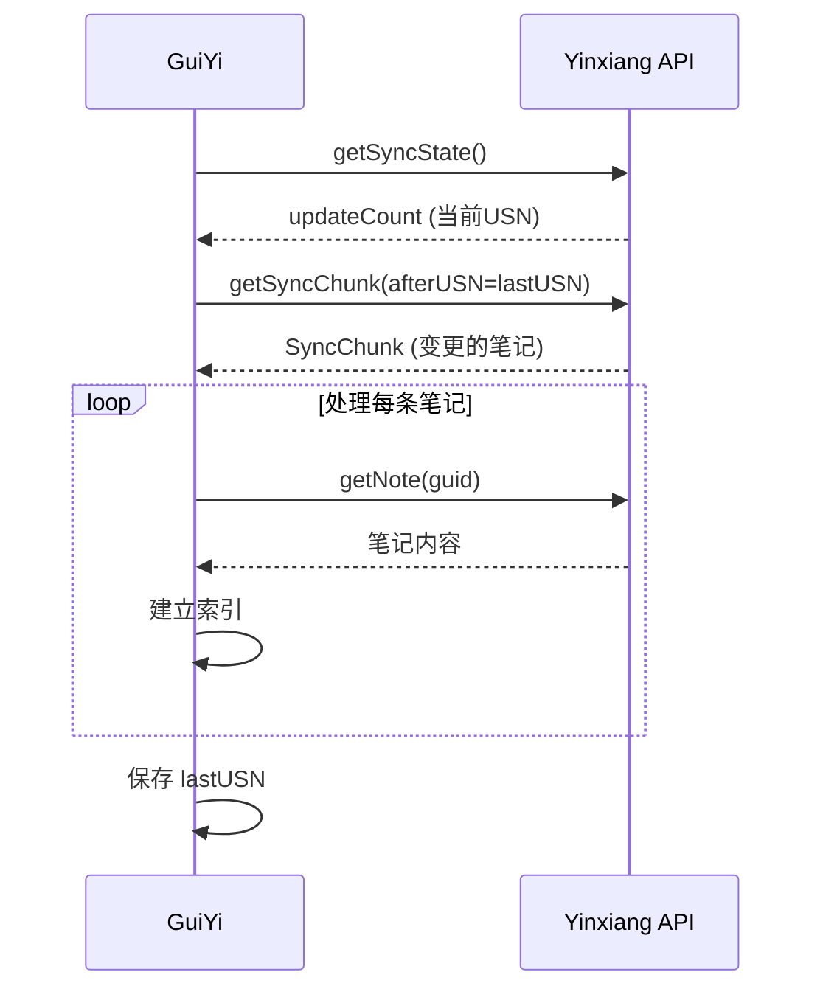
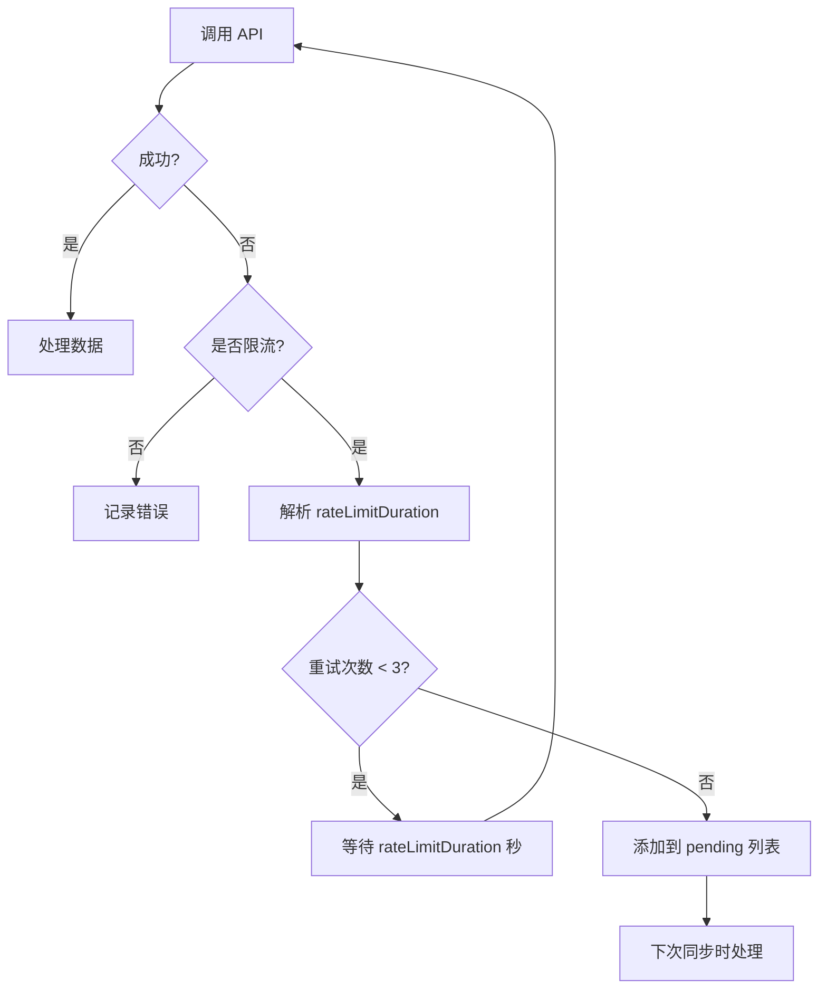

# 印象笔记索引规则

> 印象笔记/Evernote 文档索引与同步规则

---

## 概述

GuiYi 支持印象笔记（中国版）和国际版 Evernote 的文档索引。采用**索引优先**策略，只在本地建立索引，原文档保留在印象笔记服务器。

---

## 认证方式

### Developer Token 认证

印象笔记适配器使用 Developer Token 进行认证，适合个人使用。

**获取方式**：
1. 登录印象笔记网页版
2. 访问开发者设置页面
3. 生成 Developer Token

**Token 格式**：
```
S=s1:U=124701:E=19dd1d06a35:C=19dadc3e5f0:P=1cd:A=en-devtoken:V=2:H=xxx
```

**Token 解析**：
- `S=s1` → Shard ID（服务器分片）
- `U=124701` → User ID（用户标识）
- 其他字段为认证信息

---

## 索引策略

### 索引优先原则

| 内容类型 | 存储方式 | 说明 |
|---------|---------|------|
| 笔记元数据 | 本地索引 | 标题、摘要、标签 |
| 笔记内容 | 本地索引（前 5000 字符） | 用于语义搜索 |
| 原始文档 | 印象笔记服务器 | 点击跳转到原文 |

### 增量同步

印象笔记 API 提供 `getSyncChunk` 接口实现增量同步：



### 同步状态存储

同步状态保存在 `data/yinxiang_sync_state.json`：

```json
{
  "sync_states": {
    "main": 105071,
    "main_synced": {
      "note-guid": {
        "updated": 1234567890,
        "usn": 100
      }
    },
    "main_pending": ["pending-note-guid-1", "pending-note-guid-2"]
  },
  "notebook_cache": {}
}
```

| 字段 | 说明 |
|------|------|
| main | 上次同步的 USN |
| main_synced | 已同步笔记的更新时间和 USN |
| main_pending | 待处理笔记列表（限流失败时保存） |

---

## API 限流处理

### 限流规则

印象笔记 API 限流规则：
- **限制单位**：每个 API Key + 每个用户 + 每小时
- **错误码**：`errorCode=19` (RATE_LIMIT_REACHED)
- **返回信息**：`rateLimitDuration`（需要等待的秒数）

### 限流处理策略



### 配置参数

| 参数 | 值 | 说明 |
|------|---|------|
| API_CALL_DELAY | 1.5 秒 | 每次 API 调用间隔 |
| RATE_LIMIT_MAX_WAIT | 3600 秒 | 单次限流最多等待 1 小时 |
| RATE_LIMIT_RETRY_COUNT | 3 | 同一笔记最多重试 3 次 |
| MAX_NOTES_PER_SYNC | 50 | 每次同步最多处理 50 条笔记 |

### 后台持续同步

当待处理笔记较多时，可启动后台持续同步：

```bash
# 触发后台同步
curl -X POST http://localhost:8765/api/yinxiang/accounts/main/background-sync
```

后台同步会：
1. 自动处理限流等待
2. 持续同步直到所有待处理笔记完成
3. 保存进度到 pending 列表

---

## URL 生成

### 正确格式

笔记 URL 格式需要包含 Shard ID、User ID 和 Note GUID：

```
https://app.yinxiang.com/shard/{shardId}/nl/{userId}/{noteGuid}
```

**示例**：
```
https://app.yinxiang.com/shard/s1/nl/124701/cf1bbf55-8115-46f2-887d-5ea95a037dec
```

### 参数解析

从 Token 自动解析：
- `shard_id`：从 `S=s1` 解析
- `user_id`：从 `U=124701` 解析

### 国际版 Evernote

国际版使用不同的域名：

```
https://www.evernote.com/shard/{shardId}/nl/{userId}/{noteGuid}
```

---

## 支持的笔记类型

| 类型 | 支持 | 说明 |
|------|------|------|
| 文本笔记 | ✅ | 提取纯文本内容 |
| 图片笔记 | ⚠️ | 仅索引文本，图片不处理 |
| 附件笔记 | ⚠️ | 仅索引文本，附件不处理 |
| 表格笔记 | ✅ | 提取表格文本 |

### 内容提取

笔记内容使用 ENML 格式，系统自动提取纯文本：

```python
def _extract_text_from_enml(self, enml: str) -> str:
    """从 ENML 提取纯文本"""
    # 移除 XML 声明
    text = re.sub(r'<\?xml[^>]*\?>', '', enml)
    # 移除 HTML 标签
    text = re.sub(r'<[^>]+>', ' ', text)
    # 清理空白
    text = re.sub(r'\s+', ' ', text).strip()
    return html.unescape(text)
```

---

## 配置示例

### 添加账号

```bash
curl -X POST http://localhost:8765/api/yinxiang/accounts \
  -H "Content-Type: application/json" \
  -d '{
    "name": "main",
    "token": "S=s1:U=124701:E=...",
    "note_store_url": "https://app.yinxiang.com/shard/s1/notestore",
    "is_china": true,
    "sync_notebooks": []
  }'
```

### 指定同步笔记本

```json
{
  "name": "main",
  "token": "S=s1:U=124701:E=...",
  "note_store_url": "https://app.yinxiang.com/shard/s1/notestore",
  "is_china": true,
  "sync_notebooks": ["工作笔记", "学习资料"]
}
```

---

## 故障排除

### 常见错误

| 错误 | 原因 | 解决方案 |
|------|------|---------|
| `Owner Id must be numeric` | URL 格式错误 | 检查 URL 是否包含 user_id |
| `RATE_LIMIT_REACHED` | API 限流 | 等待或启动后台同步 |
| `Invalid authentication token` | Token 过期或无效 | 重新生成 Token |
| `Note not found` | 笔记已删除 | 重置同步状态 |

### 重置同步

```bash
curl -X POST http://localhost:8765/api/yinxiang/accounts/main/reset-sync
```

---

## 相关文档

- [技术架构](./architecture.md)
- [API 参考](./api-reference.md)
- [飞书文档索引规则](./feishu-index-rules.md)
