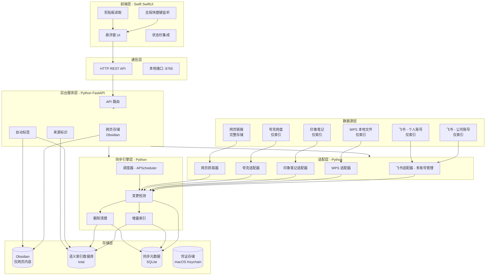
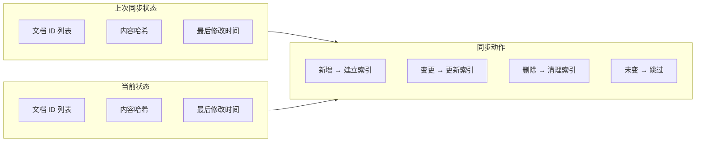
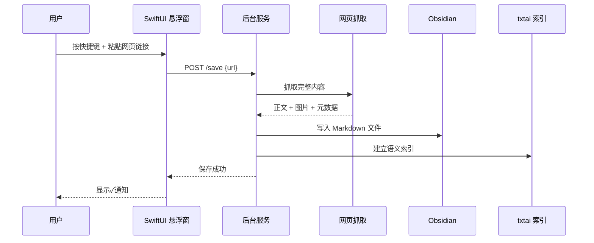
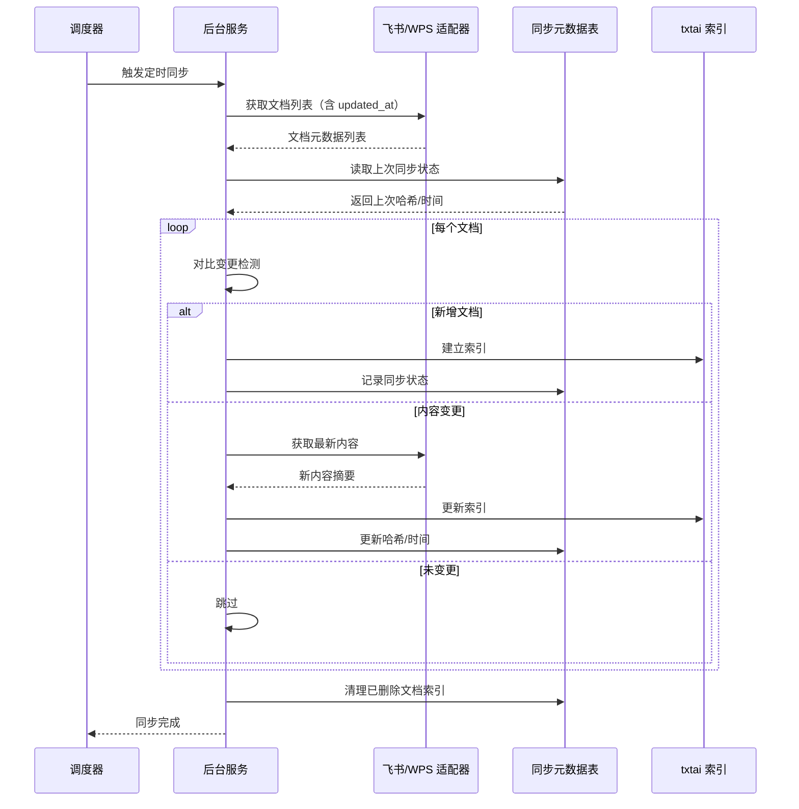

# 归一GuiYi-需求与技术方案

> 一个本地优先的个人知识收集与检索系统
> 核心场景：丢链接 → 自动抓取 → 存 Obsidian → 语义搜索
> **项目代号：归一 GuiYi**（万流归一）

---

## 一、项目背景与目标

### 1.1 核心痛点

- 知识/信息分散在多个平台（飞书、WPS、印象笔记、夸克网盘、网页等）
- **飞书多账号（公司 + 个人）文档分散，无法统一检索**
- 看到好文章想保存，但收藏后从未再看过
- 检索困难，无法跨平台快速找到所需内容
- 传统关键词搜索对记忆模糊的内容无效
- 数据敏感，不希望上传至第三方云服务
- **三方平台内容重复存储浪费空间，只需索引即可**
- **索引如何同步更新？内容变了/删了怎么办？**

### 1.2 项目目标

构建一个**本地优先、索引优先、增量同步、语义检索、多账号支持**的个人知识管理系统：

- **一键保存**：全局快捷键呼出，粘贴链接即保存
- **多源聚合**：支持飞书、WPS、印象笔记、夸克网盘、网页
- **多账号支持**：飞书公司账号 + 个人账号同时管理
- **索引优先**：三方平台内容只建索引，原文档保留在原平台
- **增量同步**：智能检测变更，只更新变化的部分
- **网页完整抓取**：网页内容完整存储到 Obsidian（防止失效）
- **语义索引**：支持自然语言搜索（"我上周存的那篇 Python 文章"）
- **本地运行**：所有数据处理在本地完成，隐私安全
- **自动标签**：AI 分析内容，自动打标签

---

## 二、用户场景与核心功能

### 2.1 典型用户场景

1. **快速保存**：浏览网页时看到好文章，按快捷键 → 粘贴链接 → 回车，文章自动存入 Obsidian
2. **语义搜索**：记得"上周存了篇 Python 性能的文章"，输入"Python 性能优化"，系统找到相关文档
3. **跨平台搜索**：一次性搜索飞书、WPS、印象笔记、夸克网盘、网页所有内容
4. **来源跳转**：搜索结果直接跳转到原平台（飞书文档、印象笔记等）
5. **后台同步**：每天自动同步各平台最新内容，索引保持最新
6. **变更通知**：飞书文档更新了，收到通知问要不要更新索引

### 2.2 数据存储策略

|数据源|存储策略|更新策略|说明|
|---|---|---|---|
|**网页**|**完整存储**|不自动更新|网页可能失效，完整抓取存 Obsidian|
|**飞书**|**仅索引**|增量同步|原文档保留在飞书，检测变更后更新索引|
|**WPS**|**仅索引**|文件监听|原文件在本地，文件变更时更新索引|
|**印象笔记**|**仅索引**|增量同步|原笔记保留在印象笔记，检测变更后更新索引|
|**夸克网盘**|**仅索引**|手动/定时|原文件保留在网盘，手动触发或定时同步|

### 2.3 MVP 功能范围

|功能模块|描述|优先级|
|---|---|---|
|全局快捷键|macOS 原生悬浮窗，类似 Alfred|高|
|网页抓取|完整正文 + 图片 + 格式，存 Obsidian|高|
|**飞书多账号**|仅索引，增量同步|高|
|**WPS 接入**|仅索引，文件监听|高|
|**印象笔记接入**|仅索引，增量同步|中|
|**夸克网盘接入**|仅索引，手动/定时|中|
|**增量同步引擎**|检测变更、更新索引、清理删除|高|
|语义索引|txtai 向量化，支持自然语言搜索|高|
|来源跳转|搜索结果带原文链接，一键跳转|高|
|自动标签|AI 分析内容生成标签|中|
|来源筛选|按数据源/账号筛选搜索结果|中|
|定期回顾|推送未读内容|低|

---

## 三、技术架构设计

### 3.1 总体架构

采用 **Swift 前端 + Python 后台服务** 的分离架构：



### 3.2 索引同步更新机制

#### 核心思路



#### 变更检测策略

|数据源|检测方式|判断依据|
|---|---|---|
|**飞书**|API `updated_at` 字段|最后编辑时间变更|
|**WPS**|文件系统 `mtime` + 内容哈希|文件修改时间或 MD5 变更|
|**印象笔记**|API `updateSequenceNum`|笔记序列号变更|
|**夸克网盘**|文件 `mtime` 或 哈希|文件修改时间变更|
|**网页**|不自动更新|手动重新保存|

#### 同步元数据表设计

```sql
-- 记录每个文档的同步状态
CREATE TABLE sync_metadata (
    id TEXT PRIMARY KEY,           -- 文档 ID（如 feishu_company_123456）
    source TEXT NOT NULL,          -- 来源（feishu/wps/yinxiang/quark）
    account TEXT,                  -- 账号标识（feishu_company/feishu_personal）
    url TEXT,                      -- 原文链接/文件路径
    title TEXT,                    -- 标题
    content_hash TEXT,             -- 内容哈希（MD5）
    last_modified REAL,            -- 最后修改时间戳
    last_synced REAL,              -- 最后同步时间戳
    sync_status TEXT,              -- 同步状态（synced/failed/deleted）
    created_at REAL DEFAULT (strftime('%s', 'now'))
);

-- 索引变更日志
CREATE TABLE sync_logs (
    id INTEGER PRIMARY KEY AUTOINCREMENT,
    sync_time REAL,
    source TEXT,
    action TEXT,                   -- added/updated/deleted/skipped
    doc_id TEXT,
    doc_title TEXT,
    error_message TEXT
);
```

### 3.3 数据流

#### 网页保存流程（完整存储）



#### 增量同步流程（三方平台）



### 3.4 数据源接入详情

|数据源|接入方式|存储策略|更新策略|所需凭证|
|---|---|---|---|---|
|**飞书 - 公司**|官方 API|仅索引|定时同步（检测 `updated_at`）|公司 AppID + AppSecret|
|**飞书 - 个人**|官方 API|仅索引|定时同步（检测 `updated_at`）|个人 AppID + AppSecret|
|**WPS**|本地文件扫描|仅索引|文件监听（`mtime` + 哈希）|无|
|**印象笔记**|官方 API|仅索引|定时同步（检测 `updateSequenceNum`）|开发者 Token|
|**夸克网盘**|网页 API/第三方库|仅索引|手动/定时|Cookie/Token|
|**网页**|直接抓取|**完整存储**|不自动更新|无|

### 3.5 核心技术选型

#### 前端层（Swift）

|组件|技术选择|理由|
|---|---|---|
|**UI 框架**|SwiftUI|macOS 原生，轻量，启动快，现代化声明式 UI|
|**全局快捷键**|HotKey（第三方库）|系统级快捷键监听，支持全局唤醒|
|**状态栏集成**|NSStatusItem|原生 API，常驻状态栏|
|**剪贴板**|NSPasteboard|原生 API，读取剪贴板链接|
|**HTTP 请求**|URLSession|原生网络库，调用后台 API|
|**通知**|UserNotifications|系统通知反馈|

#### 后台服务层（Python）

|组件|技术选择|理由|
|---|---|---|
|**Web 框架**|FastAPI|高性能异步框架，自动生成 API 文档|
|**网页抓取**|trafilatura + httpx|正文提取效果好，支持复杂页面|
|**飞书 SDK**|lark-oapi|官方 Python SDK，稳定|
|**印象笔记 SDK**|evernote3|官方 SDK|
|**WPS 解析**|python-docx, openpyxl, PyPDF2|处理 Office 文件|
|**夸克网盘**|quark-api 或 网页模拟|无官方 API|
|**语义索引**|txtai + BAAI/bge-m3|本地向量数据库，中文优化|
|**同步元数据**|SQLite + SQLAlchemy|轻量，无需额外服务|
|**文件监听**|watchdog|跨平台文件系统事件监听|
|**任务调度**|APScheduler|支持 Cron、Interval 触发|
|**凭证存储**|keyring 库|安全访问 macOS Keychain|

#### 进程通信与部署

|组件|技术选择|说明|
|---|---|---|
|**通信协议**|HTTP REST API|FastAPI 提供 API，Swift 通过 URLSession 调用|
|**本地端口**|8765|后台服务监听本地端口|
|**后台服务**|launchd|通过 plist 配置，开机自启，常驻后台|
|**日志管理**|logging + logrotate|Python logging 模块，日志轮转|

### 3.6 数据模型设计

```python
# 索引元数据模型（全部内容）
class IndexedDocument:
    id: str              # 唯一标识
    title: str           # 标题
    url: str             # 原文链接/文件路径
    content_summary: str # 内容摘要（用于索引）
    author: str          # 作者（可选）
    published_at: str    # 发布时间（可选）
    indexed_at: datetime # 索引时间
    tags: List[str]      # 自动标签
    source: str          # 来源（feishu/wps/yinxiang/quark/web）
    account: str         # 账号标识（feishu_company / feishu_personal）
    store_locally: bool  # 是否本地存储（仅网页为 True）
    file_path: str       # 本地文件路径（仅网页有）
```

```yaml
# Markdown 文件头部（仅网页内容）
---
title: 文章标题
url: https://example.com/article
author: 作者名
published_at: 2026-03-28
saved_at: 2026-03-28T15:00:00
tags: [技术，Python, 性能优化]
source: web
store_locally: true
---

# 正文内容（完整）
```

```yaml
# 飞书文档索引元数据（示例，不存为文件）
{
    "id": "feishu_company_123456",
    "title": "Q4 技术规划",
    "url": "https://feishu.cn/docs/123456",
    "content_summary": "本文档描述了 2024 年 Q4 的技术规划，包括 AI 项目、性能优化...",
    "source": "feishu",
    "account": "feishu_company",
    "store_locally": false
}
```

### 3.7 进程通信设计

#### API 接口设计

```python
# FastAPI 路由设计
from fastapi import FastAPI
from pydantic import BaseModel

app = FastAPI(title="GuiYi Backend API")

class SaveRequest(BaseModel):
    url: str

class SearchRequest(BaseModel):
    query: str
    source: str = None  # feishu/wps/web/all
    account: str = None
    limit: int = 10

class SyncRequest(BaseModel):
    source: str  # feishu/wps/yinxiang/quark
    account: str = None

# 核心路由
@app.post("/api/save")
async def save_url(req: SaveRequest):
    """保存网页链接"""
    pass

@app.post("/api/search")
async def search(req: SearchRequest):
    """语义搜索"""
    pass

@app.post("/api/sync")
async def sync_source(req: SyncRequest):
    """手动触发同步"""
    pass

@app.get("/api/status")
async def get_status():
    """获取服务状态"""
    pass

@app.get("/api/sources")
async def list_sources():
    """列出已配置的数据源"""
    pass
```

#### Swift 客户端调用

```swift
import Foundation

class APIClient {
    static let baseURL = "http://localhost:8765"

    static func save(url: String) async throws {
        let payload = ["url": url]
        let data = try JSONSerialization.data(withJSONObject: payload)

        var request = URLRequest(url: URL(string: "\(baseURL)/api/save")!)
        request.httpMethod = "POST"
        request.httpBody = data
        request.setValue("application/json", forHTTPHeaderField: "Content-Type")

        let (_, response) = try await URLSession.shared.data(for: request)

        guard let httpResponse = response as? HTTPURLResponse,
              httpResponse.statusCode == 200 else {
            throw APIClientError.saveFailed
        }
    }

    static func search(query: String) async throws -> [SearchResult] {
        // 实现搜索接口调用
        return []
    }
}
```

### 3.8 部署模式

#### 后台服务配置（launchd）

```xml
<!-- ~/Library/LaunchAgents/com.guiyi.service.plist -->
<?xml version="1.0" encoding="UTF-8"?>
<!DOCTYPE plist PUBLIC "-//Apple//DTD PLIST 1.0//EN" "http://www.apple.com/DTDs/PropertyList-1.0.dtd">
<plist version="1.0">
<dict>
    <key>Label</key>
    <string>com.guiyi.service</string>
    <key>ProgramArguments</key>
    <array>
        <string>/Users/yswwpp/dev/project/tools/GuiYi/guiyi-server/.venv/bin/python</string>
        <string>/Users/yswwpp/dev/project/tools/GuiYi/guiyi-server/main.py</string>
    </array>
    <key>RunAtLoad</key>
    <true/>
    <key>KeepAlive</key>
    <true/>
    <key>StandardOutPath</key>
    <string>/tmp/guiyi.log</string>
    <key>StandardErrorPath</key>
    <string>/tmp/guiyi.error.log</string>
</dict>
</plist>
```

```bash
# 启动服务
launchctl load ~/Library/LaunchAgents/com.guiyi.service.plist

# 停止服务
launchctl unload ~/Library/LaunchAgents/com.guiyi.service.plist

# 重启服务
launchctl restart com.guiyi.service
```

#### 应用打包

```bash
# Swift GUI 打包为 .app
cd guiyi-client
xcodebuild -project GuiYi.xcodeproj -scheme GuiYi -configuration Release

# Python 依赖打包（可选）
cd guiyi-server
pyinstaller main.py --name guiyi-backend
```

---

## 四、分阶段实施计划

### 4.1 第一阶段：核心引擎验证（1 周）

**目标**：跑通网页抓取 → Markdown → Obsidian 存储流程

**技术栈**：纯 Python + 命令行

- 进入 `guiyi-server/` 目录，创建 Python 虚拟环境
  ```bash
  cd guiyi-server
  uv venv
  source .venv/bin/activate
  uv pip install fastapi uvicorn trafilatura txtai
  ```
- 实现 FastAPI 后台服务框架
  - `/api/save` 接口：接收 URL，调用抓取器
  - `/api/status` 接口：返回服务状态
- 实现网页抓取器（trafilatura）
  - 正文提取、图片下载、Markdown 转换
  - 写入 Obsidian inbox 目录
- 基础 txtai 索引（网页内容）
- 命令行测试工具 `guiyi save <url>`

**产出**：可运行的 Python 后台服务 + CLI 测试工具

### 4.2 第二阶段：SwiftUI 前端（1 周）

**目标**：实现全局快捷键 + 悬浮窗

**技术栈**：Swift + SwiftUI

- 在 `guiyi-client/` 目录下创建 Xcode 项目
- 实现悬浮窗 UI（类似 Alfred）
  - 单行输入框
  - 自动读取剪贴板链接
  - 保存状态反馈（✓ / ✗）
- 全局快捷键监听（HotKey 库）
  - 默认 `Cmd+Shift+S` 唤醒悬浮窗
- 与后台 API 通信（URLSession）
- 状态栏图标（NSStatusItem）
  - 显示服务状态
  - 右键菜单：同步、设置、退出

**产出**：可运行的 macOS App `GuiYi.app`

### 4.3 第三阶段：飞书多账号 + WPS 索引（2 周）

**目标**：接入最高频的数据源（仅索引）

**技术栈**：Python 后端

- **飞书多账号管理（公司 + 个人）**
  - 凭证存储到 macOS Keychain（keyring 库）
  - 飞书 API 对接，获取云文档列表
  - 文档摘要提取（用于索引）
- **WPS 本地文件夹扫描**
  - 文件系统扫描（docx/xlsx/pdf）
  - 内容提取 + 摘要生成
- **增量同步引擎**
  - SQLite 同步元数据表
  - 变更检测（哈希 + 修改时间）
  - 增量更新索引
- **文件监听（watchdog）**
  - 监听 WPS 文件夹变更
  - 实时更新索引
- 支持按来源/账号筛选搜索

**产出**：支持飞书（多账号）、WPS、网页的统一搜索

### 4.4 第四阶段：印象笔记 + 夸克网盘（2 周）

**目标**：完成剩余数据源接入（仅索引）

**技术栈**：Python 后端

- 印象笔记 API 对接（evernote3）
  - 获取笔记列表
  - 提取笔记摘要
- 夸克网盘接入
  - 第三方库或网页模拟
  - 文件列表获取
- 增量同步机制优化
- 去重检测（URL/标题相似度）

**产出**：支持全部数据源

### 4.5 第五阶段：语义搜索与体验优化（1 周）

**目标**：提升使用体验

**技术栈**：全栈优化

- txtai 完整索引（bge-m3 向量化）
- 自然语言搜索优化
- 自动标签（AI 分析，可选）
- 搜索结果排序优化
- 通知与反馈优化
- launchd 配置后台服务自启动
- 应用签名与公证（可选）

**产出**：可日常使用的完整工具

---

## 五、项目目录结构

采用 Monorepo 模式，前后端项目在同一个 Git 仓库下：

```
GuiYi/                              # Git 仓库根目录
├── guiyi-server/                   # Python 后端项目
│   ├── main.py                    # FastAPI 入口
│   ├── config.py                  # 配置文件
│   ├── requirements.txt           # Python 依赖
│   ├── adapters/                  # 数据源适配器
│   │   ├── __init__.py
│   │   ├── feishu_adapter.py      # 飞书（多账号）
│   │   ├── wps_adapter.py         # WPS 本地文件
│   │   ├── yinxiang_adapter.py    # 印象笔记
│   │   ├── quark_adapter.py       # 夸克网盘
│   │   └── web_scraper.py         # 网页抓取
│   ├── sync/                      # 同步引擎
│   │   ├── __init__.py
│   │   ├── engine.py              # 增量同步逻辑
│   │   ├── metadata.py            # 同步元数据管理
│   │   ├── scheduler.py           # 定时任务调度
│   │   └── watcher.py             # 文件监听
│   ├── index/                     # 索引管理
│   │   ├── __init__.py
│   │   ├── txtai_index.py         # txtai 向量索引
│   │   └── models.py              # 数据模型
│   ├── storage/                   # 存储管理
│   │   ├── __init__.py
│   │   ├── obsidian.py            # Obsidian 写入
│   │   └── keychain.py            # 凭证管理
│   └── tests/                     # 后端测试
│       ├── __init__.py
│       ├── test_adapters.py
│       └── test_sync.py
├── guiyi-client/                   # Swift 前端项目
│   ├── GuiYi.xcodeproj/           # Xcode 项目文件
│   ├── GuiYi/
│   │   ├── GuiYiApp.swift         # 应用入口
│   │   ├── Views/                 # SwiftUI 视图
│   │   │   ├── ContentView.swift  # 主视图
│   │   │   └── SettingsView.swift # 设置视图
│   │   ├── Services/              # API 客户端
│   │   │   └── APIClient.swift    # 后端 API 调用
│   │   ├── Utils/                 # 工具类
│   │   │   └── HotKeyManager.swift# 快捷键管理
│   │   └── Resources/             # 资源文件
│   │       └── Assets.xcassets    # 图标等资源
│   └── GuiYiTests/                # 前端测试
├── data/                          # 共享数据目录（Git 忽略）
│   ├── index/                     # txtai 索引数据库
│   ├── obsidian_vault/            # Obsidian 库（用户配置）
│   │   └── inbox/                 # 网页内容存储
│   └── sync_metadata.sqlite       # 同步元数据
├── docs/                          # 项目文档
│   └── 归一GuiYi-需求与技术方案.md
├── .gitignore                     # Git 忽略配置
├── README.md                      # 项目说明
└── Makefile                       # 常用命令（可选）
```

### 说明

- **guiyi-server/**：Python 后端项目，负责数据处理、同步、索引
- **guiyi-client/**：Swift 前端项目，通过 Xcode 创建和管理
- **data/**：运行时数据，不提交到 Git
- **docs/**：项目文档
- **Monorepo 优势**：前后端代码统一管理，版本同步更新

---

## 六、关键代码示例

### 6.1 FastAPI 后台服务入口

```python
# guiyi-server/main.py
from fastapi import FastAPI, BackgroundTasks
from pydantic import BaseModel
from typing import List, Optional
import uvicorn
import time

app = FastAPI(title="GuiYi Backend", version="1.0.0")

# 请求模型
class SaveRequest(BaseModel):
    url: str

class SearchRequest(BaseModel):
    query: str
    source: Optional[str] = None
    account: Optional[str] = None
    limit: int = 10

class SyncRequest(BaseModel):
    source: str
    account: Optional[str] = None

# 响应模型
class SearchResult(BaseModel):
    id: str
    title: str
    url: str
    source: str
    account: Optional[str]
    score: float

class StatusResponse(BaseModel):
    status: str
    uptime: float
    sources: List[str]

# API 路由
@app.post("/api/save")
async def save_url(req: SaveRequest, background_tasks: BackgroundTasks):
    """保存网页链接"""
    from adapters.web_scraper import WebScraper
    from index.txtai_index import IndexManager

    scraper = WebScraper()
    index = IndexManager()

    # 后台任务：抓取 + 索引
    background_tasks.add_task(scraper.fetch_and_save, req.url)
    background_tasks.add_task(index.index_url, req.url)

    return {"status": "processing", "url": req.url}

@app.post("/api/search", response_model=List[SearchResult])
async def search(req: SearchRequest):
    """语义搜索"""
    from index.txtai_index import IndexManager

    index = IndexManager()
    results = index.search(
        query=req.query,
        source=req.source,
        account=req.account,
        limit=req.limit
    )

    return [
        SearchResult(
            id=r["id"],
            title=r["title"],
            url=r["url"],
            source=r["source"],
            account=r.get("account"),
            score=r["score"]
        )
        for r in results
    ]

@app.post("/api/sync")
async def sync_source(req: SyncRequest, background_tasks: BackgroundTasks):
    """手动触发同步"""
    from sync.engine import SyncEngine
    from sync.scheduler import get_adapter

    engine = SyncEngine()
    adapter = get_adapter(req.source, req.account)

    # 后台任务：同步
    background_tasks.add_task(engine.sync_source, req.source, adapter, req.account)

    return {"status": "syncing", "source": req.source}

@app.get("/api/status", response_model=StatusResponse)
async def get_status():
    """获取服务状态"""
    return StatusResponse(
        status="running",
        uptime=time.time() - START_TIME,
        sources=["feishu", "wps", "web"]
    )

if __name__ == "__main__":
    START_TIME = time.time()
    uvicorn.run(app, host="127.0.0.1", port=8765)
```

### 6.2 同步元数据管理

```python
import sqlite3
import hashlib
from datetime import datetime
from typing import Optional, Dict, List

class SyncMetadata:
    """同步元数据管理"""
    
    def __init__(self, db_path="index/sync_metadata.sqlite"):
        self.db_path = db_path
        self._init_db()
    
    def _init_db(self):
        """初始化数据库"""
        conn = sqlite3.connect(self.db_path)
        cursor = conn.cursor()
        
        cursor.execute("""
            CREATE TABLE IF NOT EXISTS sync_metadata (
                id TEXT PRIMARY KEY,
                source TEXT NOT NULL,
                account TEXT,
                url TEXT,
                title TEXT,
                content_hash TEXT,
                last_modified REAL,
                last_synced REAL,
                sync_status TEXT,
                created_at REAL DEFAULT (strftime('%s', 'now'))
            )
        """)
        
        cursor.execute("""
            CREATE TABLE IF NOT EXISTS sync_logs (
                id INTEGER PRIMARY KEY AUTOINCREMENT,
                sync_time REAL,
                source TEXT,
                action TEXT,
                doc_id TEXT,
                doc_title TEXT,
                error_message TEXT
            )
        """)
        
        conn.commit()
        conn.close()
    
    def _calculate_hash(self, content: str) -> str:
        """计算内容哈希"""
        return hashlib.md5(content.encode('utf-8')).hexdigest()
    
    def get_doc_state(self, doc_id: str) -> Optional[Dict]:
        """获取文档上次同步状态"""
        conn = sqlite3.connect(self.db_path)
        conn.row_factory = sqlite3.Row
        cursor = conn.cursor()
        cursor.execute(
            "SELECT * FROM sync_metadata WHERE id = ?",
            (doc_id,)
        )
        row = cursor.fetchone()
        conn.close()
        return dict(row) if row else None
    
    def upsert_doc(self, doc_id: str, source: str, url: str, title: str,
                   content_hash: str, last_modified: float, account: str = None):
        """插入或更新文档同步状态"""
        conn = sqlite3.connect(self.db_path)
        cursor = conn.cursor()
        cursor.execute("""
            INSERT OR REPLACE INTO sync_metadata 
            (id, source, account, url, title, content_hash, last_modified, last_synced, sync_status)
            VALUES (?, ?, ?, ?, ?, ?, ?, ?, ?)
        """, (doc_id, source, account, url, title, content_hash, 
              last_modified, datetime.now().timestamp(), "synced"))
        conn.commit()
        conn.close()
    
    def mark_deleted(self, doc_id: str):
        """标记文档已删除"""
        conn = sqlite3.connect(self.db_path)
        cursor = conn.cursor()
        cursor.execute(
            "UPDATE sync_metadata SET sync_status = 'deleted' WHERE id = ?",
            (doc_id,)
        )
        conn.commit()
        conn.close()
    
    def get_all_synced_docs(self, source: str = None, account: str = None) -> List[Dict]:
        """获取所有已同步文档"""
        conn = sqlite3.connect(self.db_path)
        conn.row_factory = sqlite3.Row
        cursor = conn.cursor()
        
        query = "SELECT * FROM sync_metadata WHERE sync_status = 'synced'"
        params = []
        
        if source:
            query += " AND source = ?"
            params.append(source)
        if account:
            query += " AND account = ?"
            params.append(account)
        
        cursor.execute(query, params)
        rows = cursor.fetchall()
        conn.close()
        return [dict(row) for row in rows]
    
    def cleanup_deleted(self, current_doc_ids: List[str], source: str = None, account: str = None):
        """清理已删除文档的索引"""
        conn = sqlite3.connect(self.db_path)
        cursor = conn.cursor()
        
        # 找出不在当前列表中的文档
        placeholders = ",".join("?" * len(current_doc_ids))
        query = f"""
            SELECT id FROM sync_metadata 
            WHERE sync_status = 'synced' 
            AND id NOT IN ({placeholders})
        """
        params = list(current_doc_ids)
        
        if source:
            query += " AND source = ?"
            params.append(source)
        if account:
            query += " AND account = ?"
            params.append(account)
        
        cursor.execute(query, params)
        deleted_docs = [row[0] for row in cursor.fetchall()]
        
        # 标记为删除
        for doc_id in deleted_docs:
            self.mark_deleted(doc_id)
        
        conn.close()
        return deleted_docs
    
    def log_sync(self, source: str, action: str, doc_id: str, doc_title: str, error: str = None):
        """记录同步日志"""
        conn = sqlite3.connect(self.db_path)
        cursor = conn.cursor()
        cursor.execute("""
            INSERT INTO sync_logs (sync_time, source, action, doc_id, doc_title, error_message)
            VALUES (?, ?, ?, ?, ?, ?)
        """, (datetime.now().timestamp(), source, action, doc_id, doc_title, error))
        conn.commit()
        conn.close()
```

### 6.3 增量同步引擎

```python
from typing import List, Dict
from datetime import datetime

class SyncEngine:
    """增量同步引擎"""
    
    def __init__(self, metadata: SyncMetadata, index_manager: IndexManager):
        self.metadata = metadata
        self.index = index_manager
    
    def sync_source(self, source_name: str, adapter, account: str = None):
        """
        同步单个数据源
        
        Args:
            source_name: 数据源名称（feishu/wps/yinxiang/quark）
            adapter: 对应的适配器实例
            account: 账号标识（可选）
        """
        print(f"[{datetime.now().isoformat()}] 开始同步 {source_name} ({account or 'default'})")
        
        # 1. 获取当前文档列表
        current_docs = adapter.fetch_all_for_index()
        current_ids = {doc["id"] for doc in current_docs}
        
        stats = {"added": 0, "updated": 0, "skipped": 0, "deleted": 0, "failed": 0}
        
        # 2. 逐个文档对比
        for doc in current_docs:
            try:
                doc_id = doc["id"]
                content = doc.get("content") or doc.get("content_summary", "")
                content_hash = self.metadata._calculate_hash(content)
                last_modified = doc.get("updated_at") or doc.get("last_modified")
                
                # 获取上次同步状态
                last_state = self.metadata.get_doc_state(doc_id)
                
                if last_state is None:
                    # 新增文档
                    print(f"  [+] 新增：{doc['title']}")
                    self.index.index_documents([doc])
                    self.metadata.upsert_doc(
                        doc_id=doc_id,
                        source=source_name,
                        account=account,
                        url=doc["url"],
                        title=doc["title"],
                        content_hash=content_hash,
                        last_modified=last_modified
                    )
                    self.metadata.log_sync(source_name, "added", doc_id, doc["title"])
                    stats["added"] += 1
                
                elif last_state["content_hash"] != content_hash:
                    # 内容变更
                    print(f"  [~] 更新：{doc['title']}")
                    self.index.index_documents([doc])  # txtai 支持更新
                    self.metadata.upsert_doc(
                        doc_id=doc_id,
                        source=source_name,
                        account=account,
                        url=doc["url"],
                        title=doc["title"],
                        content_hash=content_hash,
                        last_modified=last_modified
                    )
                    self.metadata.log_sync(source_name, "updated", doc_id, doc["title"])
                    stats["updated"] += 1
                
                else:
                    # 未变更，跳过
                    stats["skipped"] += 1
                
            except Exception as e:
                print(f"  [!] 失败：{doc.get('title', doc_id)} - {e}")
                self.metadata.log_sync(source_name, "failed", doc_id, doc.get("title", ""), str(e))
                stats["failed"] += 1
        
        # 3. 清理已删除文档
        deleted = self.metadata.cleanup_deleted(current_ids, source_name, account)
        for doc_id in deleted:
            print(f"  [-] 删除：{doc_id}")
            self.index.delete_document(doc_id)  # 从索引中删除
            stats["deleted"] += 1
        
        print(f"[{datetime.now().isoformat()}] 同步完成：{stats}")
        return stats
```

### 6.4 WPS 文件监听（watchdog）

```python
from watchdog.observers import Observer
from watchdog.events import FileSystemEventHandler, FileModifiedEvent, FileCreatedEvent, FileDeletedEvent
import time

class WPSFileHandler(FileSystemEventHandler):
    """WPS 文件变更监听"""
    
    def __init__(self, sync_engine: SyncEngine, adapter: WPSAdapter):
        self.sync_engine = sync_engine
        self.adapter = adapter
        self.debounce_timer = {}
    
    def on_modified(self, event):
        if event.is_directory:
            return
        if not event.src_path.endswith(('.docx', '.xlsx', '.pdf', '.pptx')):
            return
        
        # 防抖（避免短时间内多次触发）
        if event.src_path in self.debounce_timer:
            self.debounce_timer[event.src_path].cancel()
        
        timer = threading.Timer(2.0, self._sync_file, args=[event.src_path])
        timer.start()
        self.debounce_timer[event.src_path] = timer
    
    def on_created(self, event):
        self.on_modified(event)
    
    def _sync_file(self, file_path: str):
        """同步单个文件"""
        print(f"[文件变更] {file_path}")
        # 调用同步引擎更新索引
```

### 6.5 定时任务调度

```python
from apscheduler.schedulers.background import BackgroundScheduler
from apscheduler.triggers.cron import CronTrigger

class SyncScheduler:
    """同步任务调度器"""
    
    def __init__(self, sync_engine: SyncEngine):
        self.scheduler = BackgroundScheduler()
        self.sync_engine = sync_engine
    
    def start(self):
        """启动调度器"""
        # 飞书：每天早上 9 点同步
        self.scheduler.add_job(
            func=self._sync_feishu,
            trigger=CronTrigger(hour=9, minute=0),
            id="feishu_sync",
            name="飞书文档同步"
        )
        
        # 印象笔记：每天中午 12 点同步
        self.scheduler.add_job(
            func=self._sync_yinxiang,
            trigger=CronTrigger(hour=12, minute=0),
            id="yinxiang_sync",
            name="印象笔记同步"
        )
        
        # 夸克网盘：手动触发（不自动）
        
        self.scheduler.start()
        print("同步调度器已启动")
    
    def stop(self):
        """停止调度器"""
        self.scheduler.shutdown()
    
    def _sync_feishu(self):
        """同步飞书"""
        # 调用同步引擎
        pass
    
    def _sync_yinxiang(self):
        """同步印象笔记"""
        pass
    
    def sync_now(self, source: str):
        """手动立即同步指定数据源"""
        if source == "feishu":
            self._sync_feishu()
        elif source == "yinxiang":
            self._sync_yinxiang()
```

### 6.6 飞书多账号适配器（仅索引）

```python
from lark_oapi import Client
from typing import Dict, List

class FeishuAccount:
    """飞书账号配置"""
    def __init__(self, name: str, app_id: str, app_secret: str, tenant_key: str = None):
        self.name = name  # 如 "company" 或 "personal"
        self.app_id = app_id
        self.app_secret = app_secret
        self.tenant_key = tenant_key
        self.client = Client.builder() \
            .app_id(app_id) \
            .app_secret(app_secret) \
            .build()

class FeishuAdapter:
    """飞书多账号适配器 - 仅索引"""
    
    def __init__(self):
        self.accounts: Dict[str, FeishuAccount] = {}
    
    def add_account(self, account: FeishuAccount):
        """添加飞书账号"""
        self.accounts[account.name] = account
    
    def fetch_all_for_index(self):
        """从所有账号获取文档用于索引"""
        all_docs = []
        for account_name, account in self.accounts.items():
            docs = self._fetch_from_account(account)
            for doc in docs:
                doc["account"] = f"feishu_{account_name}"
                doc["store_locally"] = False
            all_docs.extend(docs)
        return all_docs
    
    def _fetch_from_account(self, account: FeishuAccount):
        """从单个账号获取文档"""
        resp = account.client.drive.v1.documents.list()
        docs = []
        for doc in resp.data.items:
            content_summary = self._get_document_summary(doc.document_id, account.client)
            docs.append({
                "id": f"feishu_{account.name}_{doc.document_id}",
                "source": "feishu",
                "title": doc.title,
                "content_summary": content_summary,
                "url": f"https://feishu.cn/docs/{doc.document_id}",
                "updated_at": doc.edit_time.timestamp()
            })
        return docs
    
    def _get_document_summary(self, doc_id, client):
        """获取文档摘要（用于索引）"""
        pass
```

### 6.7 网页抓取（完整存储）

```python
import trafilatura
import requests
from pathlib import Path

class WebScraper:
    """网页抓取器 - 完整存储"""
    
    def __init__(self, assets_dir="assets"):
        self.assets_dir = Path(assets_dir)
        self.assets_dir.mkdir(exist_ok=True)
    
    def fetch_full(self, url):
        """抓取网页，完整存储"""
        response = requests.get(url, headers={
            "User-Agent": "Mozilla/5.0 (Macintosh; Intel Mac OS X 10_15_7)"
        })
        
        content = trafilatura.extract(response.text)
        images = self._extract_images(response.text, url)
        metadata = trafilatura.extract_metadata(response.text)
        
        return {
            "title": metadata.get("title", "无标题"),
            "author": metadata.get("author", ""),
            "published_at": metadata.get("date", ""),
            "content": content,
            "images": images,
            "url": url,
            "store_locally": True
        }
    
    def _extract_images(self, html, base_url):
        """提取并下载图片"""
        from bs4 import BeautifulSoup
        soup = BeautifulSoup(html, 'html.parser')
        images = []
        
        for img in soup.find_all('img'):
            src = img.get('src') or img.get('data-src')
            if not src:
                continue
            
            if src.startswith('//'):
                src = 'https:' + src
            elif not src.startswith('http'):
                src = urlparse(base_url)._replace(path=src).geturl()
            
            try:
                img_response = requests.get(src, timeout=10)
                img_name = hashlib.md5(src.encode()).hexdigest()[:12]
                img_ext = src.split('?')[0].split('.')[-1] or 'jpg'
                img_path = self.assets_dir / f"{img_name}.{img_ext}"
                
                with open(img_path, 'wb') as f:
                    f.write(img_response.content)
                
                images.append({
                    "original_url": src,
                    "local_path": str(img_path)
                })
            except Exception as e:
                print(f"图片下载失败：{src} - {e}")
        
        return images
```

### 6.8 SwiftUI 悬浮窗

```swift
import SwiftUI

@main
struct GuiYiApp: App {
    var body: some Scene {
        WindowGroup {
            ContentView()
                .frame(width: 400, height: 120)
        }
        .windowStyle(.hiddenTitleBar)
        .windowResizability(.contentSize)
        .commands {
            CommandGroup(replacing: .newItem) {
                Button("保存链接") {
                    // 快捷键操作
                }
                .keyboardShortcut("s", modifiers: [.command, .shift])
            }
        }
    }
}

struct ContentView: View {
    @State private var url: String = ""
    @State private var isSaving = false
    @State private var showSuccess = false
    
    var body: some View {
        VStack(spacing: 16) {
            Text("归一 GuiYi")
                .font(.headline)
                .foregroundColor(.secondary)
            
            TextField("粘贴链接后回车...", text: $url)
                .textFieldStyle(.roundedBorder)
                .onSubmit { save() }
                .onAppear {
                    url = NSPasteboard.general.string(forType: .URL) ?? ""
                }
            
            if isSaving {
                ProgressView()
                    .scaleEffect(0.8)
            }
            
            if showSuccess {
                Text("✓ 已保存到 Obsidian")
                    .foregroundColor(.green)
                    .font(.caption)
            }
        }
        .padding()
    }
    
    func save() {
        guard !url.isEmpty else { return }
        isSaving = true
        
        Task {
            do {
                try await APIClient.save(url: url)
                showSuccess = true
                try await Task.sleep(nanoseconds: 1_000_000_000)
                NSApp.terminate(nil)
            } catch {
                print("保存失败：\(error)")
            }
            isSaving = false
        }
    }
}
```

---

## 七、隐私与安全设计

1. **完全本地运行**
   - 索引数据库存储在本地
   - 网页抓取在本地完成
   - 不使用云端 API（可选）

2. **凭证管理**
   - API Token、Cookie 存储在 macOS Keychain
   - 不硬编码任何凭证
   - 不上传任何用户数据

3. **数据最小化**
   - 三方平台仅索引摘要，不存储全文
   - 仅网页内容完整存储
   - 图片可选择性下载

---

## 八、后续扩展方向

1. **更多数据源**
   - 钉钉文档、语雀、Notion、Obsidian、本地邮件

2. **智能能力**
   - 自动摘要生成
   - 智能分类
   - 知识图谱关联

3. **回顾系统**
   - 每日/每周未读推送
   - 间隔重复复习

4. **跨设备同步**
   - 索引同步（不含原文）
   - 端到端加密

5. **CLI 工具**
   - `guiyi save <url>` - 命令行保存
   - `guiyi search <query>` - 命令行搜索
   - `guiyi sync <source>` - 手动同步

---

## 九、参考资源

- [trafilatura](https://trafilatura.readthedocs.io/) - 网页正文提取
- [txtai](https://neuml.github.io/txtai/) - 语义搜索
- [BAAI/bge-m3](https://huggingface.co/BAAI/bge-m3) - 中文向量模型

---

## 十、开发进度

### 当前状态（2026/04/09）

#### 已完成功能

| 模块 | 功能 | 状态 |
|------|------|------|
| 后端 | 飞书 OAuth 2.0 用户授权 | ✅ 完成 |
| 后端 | 飞书知识库递归获取 | ✅ 完成 |
| 后端 | 多文档类型支持（docx/sheet/bitable） | ✅ 完成 |
| 后端 | 向量索引（BAAI/bge-m3） | ✅ 完成 |
| 后端 | 离线模式支持 | ✅ 完成 |
| 前端 | 全局快捷键（Cmd+J） | ✅ 完成 |
| 前端 | Spotlight 风格搜索界面 | ✅ 完成 |
| 前端 | 实时搜索（防抖 300ms） | ✅ 完成 |
| 前端 | 失去焦点自动关闭 | ✅ 完成 |

#### 当前数据

- 索引文档数：**189 个**
- 知识库数：**9 个**
- 文档类型：docx、sheet、bitable、mindnote

#### 待完成事项

| 模块 | 功能 | 优先级 |
|------|------|--------|
| 后端 | 电子表格内容获取（需授权） | 中 |
| 后端 | 用户令牌刷新机制 | 高 |
| 后端 | 定时增量同步 | 中 |
| 前端 | Esc 键关闭窗口 | 低 |
| 前端 | 窗口样式美化 | 低 |
| 部署 | 后端服务自启动 | 中 |
| 部署 | 前端应用签名分发 | 低 |

#### 开发日志

- [Phase 1 测试报告](./phase1-testing.md)
- [Phase 2 设置](./phase2-setup.md)
- [Phase 3 飞书集成](./phase3-feishu-integration.md)
- [Phase 4 进度（2026/04/09）](./phase4-progress-20260409.md)

#### 快速启动

**后端服务**：
```bash
cd guiyi-server
source .venv/bin/activate
python main_phase3.py
# 服务地址：http://localhost:8765
```

**前端应用**：
```bash
cd guiyi-client
open GuiYi.xcodeproj
# 在 Xcode 中按 Cmd+R 运行
```

**使用方式**：
1. 按 `Cmd + J` 唤出搜索框
2. 输入关键词搜索
3. 点击结果打开原文档
- [SwiftUI](https://developer.apple.com/documentation/swiftui) - macOS 原生 UI
- [飞书开放平台](https://open.feishu.cn/)
- [印象笔记开发者平台](https://dev.yinxiang.com/)
- [APScheduler](https://apscheduler.readthedocs.io/) - Python 定时任务
- [watchdog](https://pypi.org/project/watchdog/) - 文件系统监听
